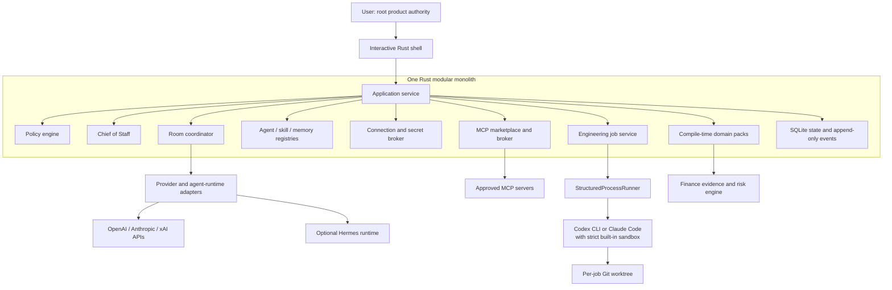
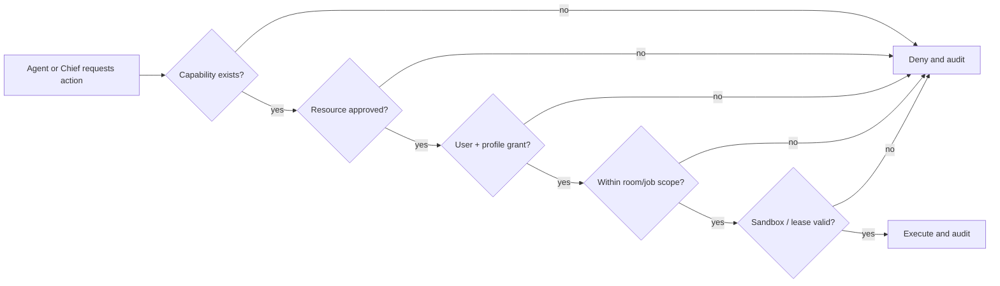
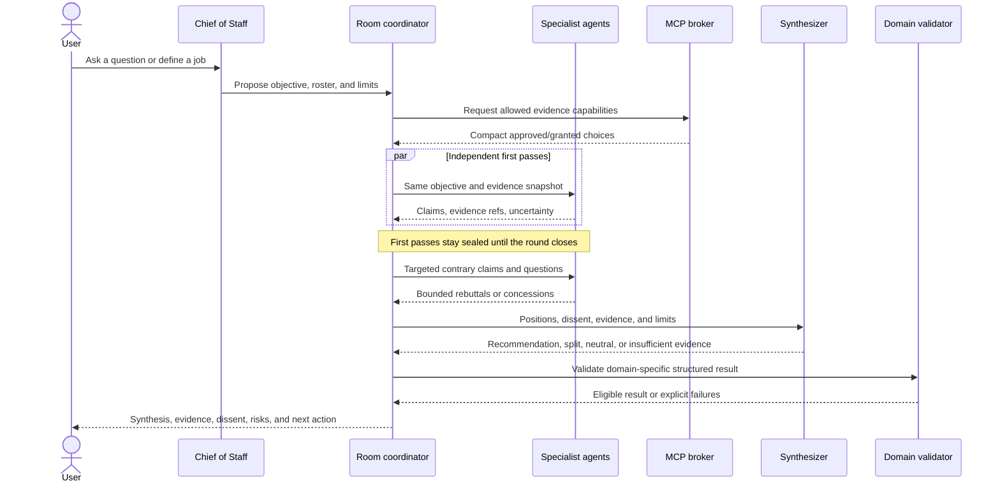
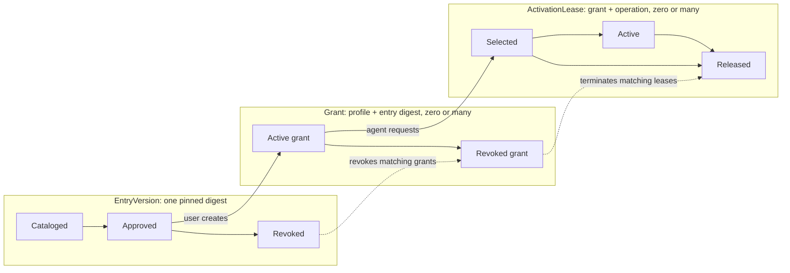
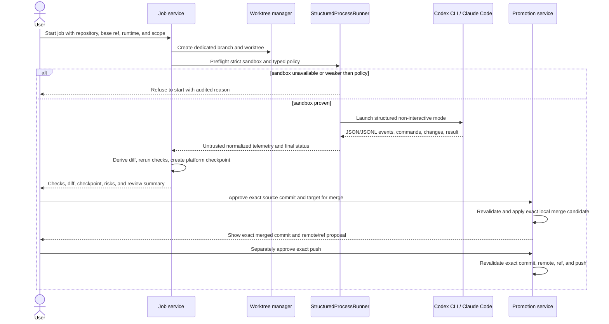

# AI Stock Forum — Agent Platform Architecture

**Status:** Proposed version 1 architecture incorporating approved decisions;
awaiting document review

**Updated:** 2026-08-29

**Delivery roadmap:** [phases.md](phases.md)

This is the canonical architecture for this repository. It replaces the earlier
Python/FastAPI/React and Hermes-first designs. Those files remain useful as
history, but they are not implementation instructions for the Rust version.

## 1. Product in plain language

AI Stock Forum is being rebuilt as a local, terminal-first agent platform where
the user creates AI agent profiles and lets them work alone or in structured
discussions. An agent profile can have its own:

- name, specialty, personality, and instructions;
- model/provider or compatible agent-runtime binding;
- versioned skills;
- persistent memory;
- approved MCP access; and
- optional engineering-runtime binding.

Finance is the first domain pack, not the platform boundary. A Bull and a Bear
can both run through Hermes, while another agent uses the approved initial direct
provider set: OpenAI, Anthropic, or xAI. The same core should later support
engineering, research, or other domains without rebuilding orchestration,
permissions, memory, or auditing.

The experience is inspired by a multi-agent group discussion, but the platform
does not copy or depend on Grok's implementation. Agents first form independent
views, then challenge relevant claims, and finally produce a bounded synthesis.
Agreement is not forced. A split decision, insufficient-evidence result, or
evidence-backed `No Trade` is valid.

The user is the product's root authority. This means the user controls agents,
permissions, jobs, and approvals; it does **not** mean the program runs as the
operating-system `root` user.

## 2. Version 1 boundary

Version 1 is:

- one local Rust executable with an interactive shell;
- single-user and terminal-only;
- provider-neutral, with direct provider adapters as the primary path;
- compatible with Hermes through a narrow optional adapter, never built on it;
- an internal, user-approved MCP marketplace with per-agent grants;
- a bounded multi-agent discussion coordinator and Chief of Staff;
- a safe engineering-job runner for Codex CLI or Claude Code;
- a finance pack for evidence-backed swing-trade research; and
- recommendation and code-change support only, with explicit human approvals.

Version 1 is not:

- a web application or full-screen TUI;
- a cloud or multi-user service;
- a broker or order-execution system;
- a community marketplace for unreviewed MCP servers or executable skills;
- a virtual-machine manager;
- an unrestricted coding-agent host; or
- an autonomous system allowed to merge or push code.

## 3. Terms that must stay separate

Several similar words refer to different things. Keeping them separate prevents
permissions and implementation details from leaking across boundaries.

| Term | Meaning | Example |
|---|---|---|
| **Agent profile** | Versioned platform configuration; not an always-running process | `Bear Analyst` |
| **Provider adapter** | Calls a model API directly | OpenAI, Anthropic, xAI |
| **Agent-runtime adapter** | Invokes another agent system behind the platform contract | Hermes |
| **Engineering runtime** | A coding CLI launched for a bounded repository job | Codex CLI, Claude Code |
| **Skill** | Versioned instructions and resources; never a permission grant | `earnings-quality-v1` |
| **MCP entry** | Approved metadata and launch/connection definition for a tool server | read-only GEX server |
| **MCP grant** | Permission for one profile to request an approved MCP entry | Bear may request GEX |
| **MCP activation** | A short-lived connection and selected schemas for one turn/job | GEX tools loaded for turn 18 |
| **Room** | A bounded, coordinator-mediated multi-agent workflow | `Analyze GOOGL swing trade` |
| **Domain pack** | Compile-time Rust module containing domain prompts, schemas, and validators | Finance pack |
| **StructuredProcessRunner** | Rust child-process supervisor; not an AI model or sandbox | launches `codex exec` |
| **Worktree** | Git change isolation for one job; not a security boundary | job branch checkout |

A single agent profile may have both an inference binding and an engineering
binding. The user chooses both. The agent may not change either binding itself.
Hermes is the optional agent runtime discussed for version 1. Herdr is a
different terminal supervisor and is deferred.

## 4. Non-negotiable safety invariants

These rules apply in every phase and cannot be weakened by a prompt, skill,
Chief of Staff, provider, MCP response, or agent-runtime response.

1. The user can inspect, interrupt, or cancel any room or job.
2. Explicit denial wins over every grant.
3. Skills and personality never grant tools, secrets, filesystem access, or
   network access.
4. Only user-approved internal MCP entries can be granted; only granted entries
   can be selected; selection still passes policy checks.
5. MCP output, web content, model output, repository text, and retrieved memory
   are untrusted data. They never supply authority or executable policy.
6. Coding jobs require both a strict built-in runtime sandbox and an isolated
   Git worktree. If sandbox enforcement is unavailable, the job does not start.
7. Version 1 has no VM mode, no unrestricted mode, and no permissive fallback.
8. A merge and a push require two different, one-shot user approvals. Approving
   a merge never approves a push.
9. Provider and runtime credentials are retrieved through a secret broker and
   are never stored in SQLite, prompts, transcripts, or job logs.
10. Finance recommendations pass deterministic validation before presentation.
    If maximum loss cannot be proven within the supported model, the result is
    ineligible rather than guessed.
11. Version 1 cannot place, stage, or transmit broker orders.

## 5. System overview



The platform is a **modular monolith**: one core application process and
executable, plus only the child processes it explicitly supervises. It is
divided into modules with explicit interfaces. This is easier to build, test,
and audit than local microservices. Later interfaces can reuse the application
service, but version 1 does not split into frontend and backend deployments.

### Suggested Rust layout

```text
ai-stock-forum/
├── Cargo.toml
├── src/
│   ├── main.rs                 # process startup only
│   ├── app/                    # use cases and command handlers
│   ├── shell/                  # REPL parsing, rendering, guided editors
│   ├── policy/                 # capabilities, grants, denials, approvals
│   ├── agents/                 # profiles, executions, normalized messages
│   ├── rooms/                  # bounded discussion state machine
│   ├── providers/              # direct model-provider adapters
│   ├── runtimes/               # Hermes and engineering CLI adapters
│   ├── skills/                 # manifests, versions, relevance loading
│   ├── memory/                 # KV and bounded episodic retrieval
│   ├── mcp/                    # catalog, grants, broker, schema loading
│   ├── jobs/                   # runner, worktrees, diff, promotion gates
│   ├── domains/
│   │   └── finance/            # evidence, GEX projection, risk validation
│   ├── persistence/            # SQLite repositories and migrations
│   └── audit/                  # typed append-only event recording
├── tests/                      # cross-module and acceptance tests
├── migrations/                # ordered SQLite migrations
└── docs/
```

Start with Rust modules. Extract a separate crate only when an interface needs
independent compilation or stronger dependency control. Domain packs are
compiled into the binary in version 1; arbitrary dynamic code plugins are not.

## 6. Authority and policy model

Every sensitive action is expressed as a typed capability, for example:

```text
mcp.invoke(entry=gex-readonly, tool=get_levels)
memory.propose(agent=bear)
job.start(runtime=codex, repository=/path/to/repo)
git.merge(job=J42, target=main, source_commit=abc123)
git.push(remote=origin, ref=main, commit=def456)
```

Effective authority is the intersection of all applicable allow-lists, minus
all applicable denials:

```text
compiled capability
∩ platform-approved resource
∩ user grant
∩ agent-profile grant
∩ room or job scope
∩ short-lived activation lease
∩ sandbox enforcement
− any explicit denial
```



The Chief of Staff is an ordinary policy-constrained agent with extra
coordination commands. It may suggest a roster and, only after the user accepts
the bounded proposal, open a room using already allowed agents. It may summarize
results and propose a job. It may not approve its own proposal, install an MCP,
expand a grant, change a secret or runtime, merge, push, or bypass deterministic
validation.

Approvals are typed, immutable, one-shot records. They include the exact object
digest and expire on material change. A generic `yes` is accepted only when the
shell displays one unambiguous pending action and records what was approved.

## 7. Agent profiles and executions

An agent profile is durable configuration. An execution is one bounded run of a
profile for a turn, room phase, or job.

```text
AgentProfileVersion
├── id, version, display_name, description
├── specialties[]
├── personality
├── operating_instructions
├── inference_binding
│   ├── direct_provider { connection_id, model }
│   └── agent_runtime { runtime_id, profile_ref }
├── optional_engineering_binding { runtime_id }
├── skill_version_refs[]
├── mcp_grant_refs[]
├── memory_namespace
├── policy_profile
└── created_at, supersedes
```

Editing creates a new immutable version and shows a diff before activation.
Rooms pin profile versions so a later edit cannot silently change an in-flight
discussion. A specialty is fixed for the lifetime of that pinned version; an
agent cannot change its own role during a room. Two profiles may use the same
Hermes installation while retaining different instructions, memory namespaces,
skills, and grants.

Hermes is therefore an optional runtime adapter, not the meaning of “agent” and
not the platform's foundation. Its adapter must return the same normalized
events and obey the same policy boundaries as direct providers. It is available
only if the adapter proves per-profile runtime state, credentials, memory, and
tool/MCP isolation; bounded execution correlation and cancellation; and
brokered enforcement of every tool request. If Hermes lacks a stable structured
interface or any required isolation, the platform reports it unavailable; it
does not screen-scrape or weaken isolation.

## 8. Interactive shell

The executable opens a line-oriented shell, for example `forum>`. Plain text is
sent to the active room or to the Chief of Staff. Slash commands manage durable
objects and explicit actions.

| Command | Purpose |
|---|---|
| `/agent create|list|show|edit|history` | Manage versioned agent profiles |
| `/room new|list|show|send|stop` | Run and inspect discussions |
| `/connection add|list|test|remove` | Manage provider/runtime connection references |
| `/marketplace list|show|approve|revoke` | Manage the internal MCP catalog |
| `/mcp grant|revoke|status` | Manage per-agent MCP eligibility |
| `/skill add|list|show|assign|unassign` | Manage versioned skills |
| `/memory get|set|list|proposals|approve|delete` | Manage durable agent memory |
| `/job start|list|show|cancel|diff` | Manage engineering jobs |
| `/approve show|accept|reject` | Resolve exact pending actions |
| `/audit show|tail|export` | Inspect normalized events and decisions |
| `/settings`, `/help`, `/quit` | Configure, learn, and exit |

Plural aliases such as `/skills` and `/agents` may map to the corresponding
`list` commands. `/agent edit` uses a guided editor by default. An optional
`$EDITOR` flow exports a secret-free temporary document, validates it, shows a
field-level diff, and asks before activating the new version.

The shell is a presentation adapter. Business rules live in the application
service, so a future web or TUI client cannot bypass policy by reimplementing
commands.

## 9. Connections, providers, and runtimes

Connections describe how an adapter authenticates. They do not grant an agent
permission to use that adapter.

Supported connection kinds are deliberately distinct:

1. **Direct API connection:** an API key stored by the operating-system secret
   store and referenced from SQLite by an opaque ID.
2. **Runtime-managed login:** a user signs in through an installed CLI or agent
   runtime. The platform records availability and a non-secret account label;
   it does not copy that runtime's token or convert it into an API key.
3. **Local MCP connection:** an approved executable or endpoint definition with
   pinned metadata and no embedded secret values.

Direct OpenAI API access and ChatGPT/Codex runtime login are separate connection
types. The same rule applies to Anthropic API keys and Claude Code login. Hermes
may use whatever legitimate authentication mode it officially supports, but the
platform never impersonates a subscription or extracts its credentials.

All adapters emit normalized events such as:

```text
Started, TextDelta, ToolRequested, ToolResult, UsageReported,
Completed, TimedOut, Cancelled, Failed
```

Provider-specific payloads are retained only when useful for debugging and are
redacted before storage. The orchestration layer consumes normalized events and
validated output schemas, not vendor-specific transcript shapes.

## 10. Chief of Staff and room discussion flow

The Chief listens to the user, asks only necessary questions, and converts a
request into a bounded room proposal: objective, roster, evidence needs,
available MCP categories, maximum rounds, time budget, and cost budget. The
user may edit, accept, interrupt, or cancel it.

Agents do not have an unrestricted peer network. The coordinator routes typed
messages and owns ordering, deadlines, and the audit trail.



The coordinator stops when the configured round, time, token, or cost bound is
reached. A timeout produces an explicitly partial result. The synthesizer may
not erase dissent, invent consensus, or use majority vote as a substitute for
evidence. For finance, deterministic validation follows synthesis.

## 11. MCP marketplace and lazy activation

Version 1 has a local internal marketplace, not arbitrary remote installation.
Each entry contains an ID, version, source, digest, transport, launch or endpoint
definition, concise capability tags, risk class, secret references, and a human
review record.



Approval, grants, and activations are separate records and lifecycles:

- **EntryVersion** says whether one exact reviewed entry digest is approved.
- **Grant** says whether one profile may request that entry digest. An approved
  entry can have many grants.
- **ActivationLease** represents one selection/connection for one turn or job.
  A grant can have multiple concurrent leases, and every new lease revalidates
  the current entry and grant state.

Lazy context loading uses a staged handshake:

1. The first prompt sees only a compact index of granted entry IDs, purposes,
   risk labels, and capability tags.
2. The agent requests one entry for a stated purpose.
3. After policy validation, the broker discovers that entry internally and
   returns a bounded summary of only its allowed tools—not their full schemas.
4. The agent selects the relevant tool or tools; the broker then loads only
   those exact schemas for the next model turn.
5. The model makes a typed invocation that the broker validates again.

Discovery caches and audit records are keyed by the approved entry digest and
discovered schema digest. The platform never places every MCP server or every
tool schema in every context window.

The broker owns process lifetime, timeouts, output-size limits, redaction, and
audit events. Read/write effect metadata is explicit per tool, but version 1
only presents and invokes read-only MCP tools. A write-capable schema in an entry
remains unavailable until a later design adds a separate typed capability and
exact approval policy. Finance uses read-only MCPs, including GEX. MCP content
is evidence with provenance, not an instruction that can modify policy or
approve another action.

“Read-only” is an enforced resource boundary, not a trusted label from an MCP.
The broker supplies read-only database/API credentials, read-only filesystem
mounts, and, where required, a mutation-denying network broker. If the platform
cannot independently prevent mutation for the declared resources, the entry
cannot activate as read-only.

Local MCP processes are launched without a shell, receive a minimal environment,
and are limited to manifest-declared filesystem and network resources by a
broker-managed host sandbox. If those declared limits cannot be enforced, the
local entry cannot activate. A marketplace review records what host access the
MCP itself needs; an agent grant never expands it. Before every activation, the
broker revalidates the canonical manifest and every local launch artifact
against its approved digest. Remote entries pin a canonical origin, expected
server identity, and schema digest. A mismatch refuses activation, creates a new
catalog version for review, and leaves old grants unusable.

## 12. Skills, personality, and memory

### Skills

A skill is a versioned declarative bundle: manifest, instructions, examples,
output schema hints, and optional static resources. It cannot contain an
executable permission grant. Agents receive compact manifests first and load
assigned skill content only when relevant. Rooms pin exact skill versions.

### Personality

Personality controls voice, perspective, and reasoning emphasis. It does not
change authority. “Aggressive trader,” “Bull,” or “security expert” never means
the agent receives additional tools or a higher risk limit.

### Memory

Version 1 uses a hybrid model:

- **Explicit KV memory:** durable facts and preferences in an agent-private
  namespace. The user can edit them directly. Agents can only propose changes;
  the user approves or rejects each durable mutation.
- **Bounded episodic summaries:** labeled summaries of completed rooms, linked
  to source event IDs. They are retrieval aids, not policy or ground truth.
- **Append-only audit events:** the full operational history, not automatically
  inserted into prompts.

Retrieval is scoped by agent, room, purpose, and size budget. Private memory is
not shared merely because two profiles use the same provider or Hermes runtime.
Cross-agent sharing happens through the room transcript or an explicit user
action and is audited.

## 13. Structured engineering jobs

The engineering agent is a normal agent profile with an optional user-selected
engineering binding. Its default may be Codex CLI or Claude Code, and the user
may override that choice for a particular job. The profile and runtime cannot
switch themselves.

### What StructuredProcessRunner is

`StructuredProcessRunner` is ordinary Rust code that supervises a child process.
It receives a typed specification rather than a shell command string:

```text
ProcessSpec
├── approved_runtime_id
├── executable and fixed adapter-owned arguments
├── structured prompt on stdin
├── isolated worktree cwd
├── minimal environment allow-list
├── timeout and output limits
├── expected JSON or JSONL event format
├── approved MCP leases
├── required sandbox capability policy
├── verified sandbox capability attestation
└── cancellation handle
```

It launches non-interactive structured modes such as Codex `exec` with JSONL
events or Claude Code print mode with stream JSON. It parses commands, file
changes, tool calls, usage, completion, and errors into normalized events. It
does not build shell strings, scrape an interactive terminal, or treat free-form
text as an authorization instruction.

Runtime events are untrusted telemetry, even when they are valid JSON. The job
service independently derives changed files, diffs, and object IDs from the
worktree. It launches approved checks in a fresh verifier sandbox with no ref
writes, credentials, or general network; repository code never executes inside
the core control-plane process.

The runner is not itself the security boundary. The runtime's strict built-in
sandbox and the platform's policy preflight enforce the boundary; the worktree
only isolates Git changes.

### Job lifecycle and approvals



### Mandatory sandbox policy

Every runtime adapter returns a machine-checkable capability report for the
exact `(host, runtime version, adapter version)` combination. A flag name or
runtime self-description is not proof. The report covers canonical writable and
readable roots, command-network denial, environment/credential isolation,
bypass and unsandboxed-retry prevention, sanitized Git-view isolation, symlink
and hardlink escape resistance, and child-process containment. Preflight fails
unless every capability required by the job policy is attested and verified by
negative conformance tests.

Attestation pins the canonical identity, digest/signature, and effective
configuration of the runtime binary, adapter build, and operating-system sandbox
backend—not only their version strings. Any identity or configuration change
disables that tuple until it passes qualification again. These components are
part of the trusted enforcement base.

- Use the runtime's strict built-in sandbox with write access limited to the
  dedicated worktree and explicitly required temporary paths.
- Refuse startup if sandbox support or its required fail-closed settings cannot
  be verified on the host.
- Never pass unrestricted, danger, permission-bypass, or unsandboxed-retry
  modes. There is no “try again with fewer restrictions” path.
- Do not use a VM in version 1.
- Give the child a minimal environment. Do not expose Git credentials, signing
  keys, unrelated provider keys, parent process secrets, or broad home-directory
  access.
- Allow only the narrow runtime-owned authentication mechanism established by
  the user's runtime login; never copy its token into the child environment or
  make the rest of the runtime configuration directory writable.
- Permit only the runtime's required inference connection and explicit
  allowlisted network/MCP routes. Sandboxed commands receive no general network
  access.
- Do not expose the actual shared Git metadata to the coding child. Give it only
  a broker-generated, sanitized, read-only Git view needed for status/diff; omit
  remote configuration, credentials, hooks, signing, and unrelated worktree
  metadata. The child may edit files but may not commit or change any ref.
- After the child exits, the trusted job service may create an audited, typed
  checkpoint on the dedicated job branch from the independently derived diff,
  using controlled Git plumbing that constructs the tree from reviewed bytes and
  disables hooks, filters, signing, credential helpers, and user/repository
  configuration side effects.
- Launch jobs with verified owner-death or guardian-process containment. On app
  restart, reconcile recorded processes and terminate surviving children before
  accepting new jobs. If containment cannot be proven, refuse the job.
- On timeout or cancellation, terminate the entire process tree, mark the job
  interrupted, and preserve the worktree for inspection.

The promotion service prepares a candidate commit in a controlled promotion
worktree with hooks, signing, user Git configuration, and credential helpers
disabled. Merge approval pins repository identity, source object ID, target ref
and expected object ID, merge strategy/options, checks digest, policy version,
abort-on-conflict behavior, candidate tree, and candidate commit. The approval
is atomically claimed before the target ref is conditionally updated; restart
reconciliation makes the operation idempotent.

Push approval is created only after the local merge. It pins the exact merged
object ID, canonical remote URL/identity, destination ref, expected remote object
ID, and fast-forward-only exact-lease mode. The approval is separately and
atomically claimed, then revalidated immediately before the single-ref push. The
transport uses an atomic expected-old-object compare-and-swap and independently
proves the new commit descends from that expected object. A broad lease, changed
expected object, or non-fast-forward update is forbidden. Any changed identity,
object, ref, check, configuration, or policy invalidates the relevant approval.
Push permission is never inferred from merge approval.

## 14. Finance domain pack

The finance pack turns the general room system into evidence-backed swing-trade
research for horizons of several days to several weeks.

### Evidence envelope

Every run pins an immutable evidence envelope with:

- symbol and as-of timestamp;
- market prices, option-chain snapshots, liquidity, and source timestamps;
- news, filing, and catalyst references;
- read-only GEX MCP results when requested;
- an explicit current user risk budget and user-provided or read-only account
  capacity snapshot when trade eligibility is requested;
- source IDs, retrieval times, freshness state, and content digests; and
- explicit missing, conflicting, or stale fields.

All independent first passes receive the same core envelope. Specialists may
receive role-relevant projections, but every cited claim points back to source
IDs. Missing MCP data remains missing; an agent may not manufacture a substitute.

### Deterministic risk engine

The risk engine is ordinary Rust, not an LLM. Agents propose a structured trade;
the engine independently checks it.

For version 1:

- only cash-funded **long** stock is supported; short stock is rejected, and
  loss-to-zero plus fees must fit the explicit current user risk budget;
- option eligibility is a closed enum: `LongCall`, `LongPut`,
  `BullCallDebitSpread`, `BearPutDebitSpread`, `BullPutCreditSpread`,
  `BearCallCreditSpread`, `LongCallButterfly`, `LongPutButterfly`, and
  `IronCondor`;
- option legs must use one underlying, one expiration, a supported unadjusted
  contract style/settlement, an explicit multiplier, integer quantities, and
  the exact ratios defined for that enum;
- the risk model covers expiration payoff, net debit/credit, fees, rounding,
  assignment, exercise, and the account capacity needed for supported interim
  settlement states;
- uncovered short options, unbounded ratio exposure, unsupported multi-expiry
  interactions, or any structure whose worst case cannot be proven are rejected;
- liquidity, freshness, concentration, capacity, and user risk-budget gates are
  deterministic. A missing budget or capacity snapshot cannot be model-defaulted
  and prevents `EligibleTradePlan`; and
- model prose can explain the result but cannot override a failed gate.

The safe rule is mechanical: **finite-looking is not enough; maximum loss must
be proven across the supported state model.** New structures become eligible by
adding tested deterministic support, not by adding a prompt exception.

### Result and approval states

A finance room returns one of:

```text
EligibleTradePlan | NoTrade | SplitDecision | InsufficientEvidence
```

Every result includes evidence references, bullish and bearish claims,
uncertainties, dissent, invalidation conditions, and why the selected state won.
`NoTrade` must cite concrete failed gates or unresolved evidence; it is not an
empty refusal.

An eligible plan contains an immutable plan ID and digest, symbol, long-stock or
named option-structure kind, shares or exact option legs, expiration/strikes,
quantities, entry limit, estimated debit/credit, proven maximum loss, pinned
risk-budget/capacity snapshot, profit/exit plan, time stop, thesis invalidation,
evidence snapshot ID, and policy/engine versions.

User approval records acceptance of that exact recommendation for planning. It
does not execute an order. Approval binds the complete canonical plan digest;
any digest-input change invalidates it. Examples include quote, leg, quantity,
expiration, contract metadata, fees/rounding, maximum loss, explicit risk budget,
capacity snapshot, exit/invalidation rule, evidence snapshot, engine version,
and policy version.

## 15. Persistence, audit, and secrets

SQLite is the local source of truth for configuration and recoverable workflow
state. Ordered migrations manage schema changes. Important records include:

- versioned agents, skills, policy profiles, and runtime bindings;
- connection metadata and opaque secret references;
- MCP entries, review records, versions, grants, and activations;
- KV memory, episodic summaries, and memory proposals;
- rooms, pinned participants, messages, evidence references, and results;
- engineering jobs, normalized events, worktrees, commits, and checks;
- finance plan versions and deterministic validation reports; and
- typed approvals, rejections, cancellations, and promotion outcomes.

Operational events are append-only and have stable IDs, actor, timestamp,
correlation ID, object version/digest, and redacted payload. Mutable views such
as “current agent version” are projections over versioned records.

Secret values live in the operating-system credential store or the owning
runtime's supported login store. SQLite stores only opaque references and safe
labels. Logs redact known secret values, authorization headers, environment
values, and raw credential files. Database and exported audit files use
owner-only filesystem permissions by default.

## 16. Failure behavior

Failing safely is part of the interface:

| Failure | Required behavior |
|---|---|
| Provider timeout or malformed output | Bounded retry, then labeled partial/failure result |
| MCP unavailable or schema changed | Release lease, mark evidence unavailable, never fabricate |
| Sandbox preflight fails | Do not start the engineering child process |
| Job times out or is cancelled | Runner kills the contained process tree, marks interrupted, preserves worktree |
| App crashes during a job | Owner-death/guardian containment kills children; restart reconciliation marks interrupted and preserves worktree |
| Evidence is stale or internally inconsistent | Fail affected finance gates; usually `NoTrade` or `InsufficientEvidence` |
| Agent/profile/plan changes after approval | Invalidate the approval and request a new exact approval |
| Merge base or source commit changes | Refuse merge until the user reviews a new proposal |
| Merged commit, remote, or destination changes | Refuse push until separately re-approved |
| Audit persistence fails for a sensitive action | Do not perform that action |

There is no silent downgrade from a safer mode to a more permissive one.

## 17. Security model

The primary local threats are prompt injection in evidence/repositories,
malicious or compromised MCP servers, overpowered personalities/skills, coding
agents executing unsafe commands, credential leakage, and ambiguous Git
approval.

The main controls are typed commands and schemas, deny-wins capability checks,
version pinning, lazy MCP activation, provenance, context separation, strict
runtime sandboxes, worktree isolation, minimal environments, secret brokering,
network limits, deterministic finance gates, exact approval digests, and an
append-only audit trail.

Version 1 trusts the local operating-system account, compiled application,
qualified runtime binary and adapter, and operating-system sandbox backend as
enforcement components. It does not claim to defend against an
already-compromised host, malicious kernel, or administrator with access to the
user's files.

## 18. Testing strategy

Implementation phases must include tests at the boundary being introduced:

- unit tests for parsing, state machines, capability intersections, and
  deterministic calculations;
- property tests for finance payoffs, maximum-loss bounds, approval invalidation,
  and deny-wins policy behavior;
- adapter contract tests using fake providers, fake runtimes, and fake MCPs;
- migration and crash-recovery tests with temporary SQLite databases;
- negative sandbox tests for unauthorized reads/writes, home and credential
  paths, symlink/hardlink escapes, network access, environment leakage, Git
  metadata writes, orphan processes, and permissive fallback attempts;
- release conformance tests for every advertised host, runtime version, and
  adapter version tuple;
- MCP lifecycle/concurrency and activation-time artifact/schema digest tests;
- Git integration tests proving merge and push approvals are separate and exact;
- transcript tests proving independent first passes remain sealed; and
- opt-in live smoke tests that require user-provided connections and never run in
  the default test suite.

Tests use synthetic market and account data. No default test requires a paid
provider, subscription, live broker, or real secret.

## 19. Deferred beyond version 1

The following are deliberate extensions, not missing foundation work:

- Herdr or another general-purpose external terminal supervisor; the narrow
  fail-closed per-job guardian required above is internal version 1 machinery;
- virtual-machine or remote worker execution;
- unrestricted or permission-bypass coding modes;
- web/mobile/full-screen TUI clients;
- multi-user accounts, remote hosting, and team authorization;
- community MCP installation and arbitrary executable skills;
- dynamically loaded domain-code plugins;
- broker write access, order staging, or order execution;
- automatic runtime switching by an agent;
- unrestricted peer-to-peer agent messaging;
- unsupported cross-expiration option structures; and
- automatic merge, push, deployment, or release.

## 20. External interface references

Implementation should verify current CLI flags against official documentation
rather than treating examples in this document as immutable command lines:

- [OpenAI Codex non-interactive mode](https://developers.openai.com/codex/noninteractive/)
- [Claude Code headless mode](https://code.claude.com/docs/en/headless)
- [Claude Code sandboxing](https://code.claude.com/docs/en/sandboxing)
- [Model Context Protocol specification](https://modelcontextprotocol.io/specification/)

## 21. Documentation precedence

When documents disagree, use this order:

1. the user's latest explicit decision;
2. this architecture;
3. [phases.md](phases.md);
4. a phase-specific implementation plan approved after these documents; then
5. older specifications and plans as historical context only.

The next step after review is to write a detailed implementation plan for Phase
0. Existing Python, React, FastAPI, and Hermes-first plans must not be executed
against this architecture without being rewritten and approved.
