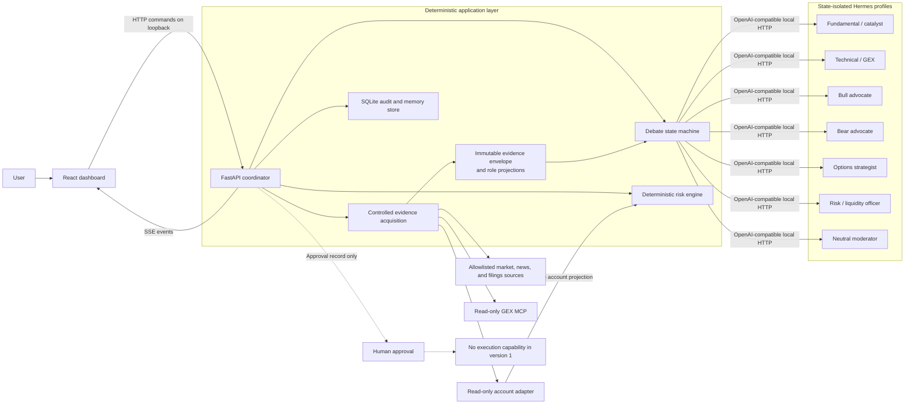
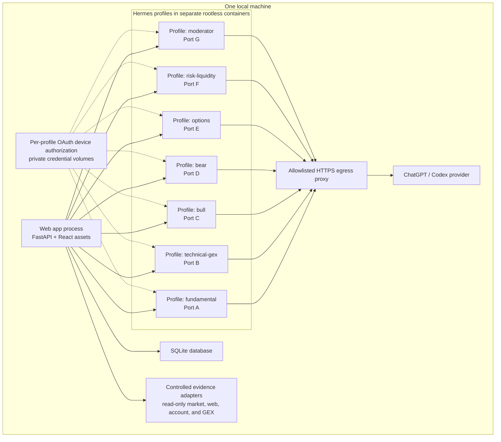
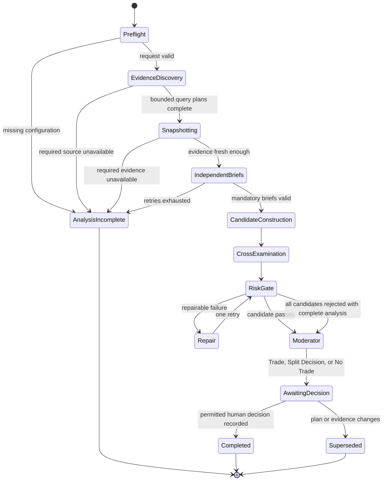

# AI Stock Forum Architecture

## What this system does

AI Stock Forum is a local research and decision-support application. A fixed
committee of Hermes agents examines role-appropriate projections of the same
timestamped market evidence from different specialties, challenges one another
once, and produces either:

- an exact stock or defined-risk options trade plan;
- a split decision with the unresolved disagreement explained; or
- an evidence-backed `No Trade` result.

The user must approve the exact recommendation version. Version 1 never sends,
stages, or transmits an order to a broker.

## Architecture at a glance



The application has two kinds of decision-making:

1. Hermes agents perform judgment: interpreting catalysts, market structure,
   contrary evidence, and alternative trade structures.
2. Ordinary software performs enforcement: schema validation, arithmetic,
   freshness checks, position sizing, workflow transitions, and approval
   invalidation.

This separation lets agents disagree about the market without changing the
expiration-payoff arithmetic, operational exposure gates, or safety rules.

## Why the agents are centrally coordinated

Agents do not freely message one another. The coordinator owns the transcript
and explicitly routes briefs, challenges, and rebuttals. This provides:

- a bounded debate rather than an endless conversation;
- a reproducible record of what each agent saw;
- protection from one agent silently changing the shared facts;
- concurrency and subscription-rate control; and
- a clear distinction between an agent failure and a legitimate `No Trade`.

```mermaid
sequenceDiagram
    actor User
    participant C as Coordinator
    participant E as Evidence builder
    participant A as Specialist agents
    participant O as Options strategist
    participant R as Risk engine
    participant M as Moderator
    participant D as Dashboard

    User->>C: Submit symbol, horizon, and constraints
    C->>A: Request bounded role-specific evidence queries
    A-->>C: Bullish, bearish, fundamental, and technical query plans
    C->>E: Acquire union through controlled read-only adapters
    E-->>C: Freeze evidence ID, role projections, timestamps, and provenance
    par Specialist first-pass analysis
        C->>A: Shared market evidence plus role projection
    and Options first-pass analysis
        C->>O: Shared market evidence plus strategy projection
    end
    A-->>C: Structured specialist briefs
    O-->>C: Structured options and volatility brief
    C->>O: Closed first-pass record; construct candidates
    O-->>C: Up to three candidates, including No Trade
    C->>A: Targeted challenges from opposing roles
    A-->>C: One rebuttal each
    C->>R: Candidate legs, quotes, account state, and evidence ID
    R-->>C: Pass or fail with deterministic calculations
    alt Repairable risk failure
        C->>O: One constrained repair request
        O-->>C: Repaired candidate
        C->>R: Revalidate once
    end
    C->>M: Validated record and dissent
    M-->>C: Trade, Split Decision, or No Trade
    C-->>D: Stream final recommendation version
    User->>D: Approve, reject, watchlist, or acknowledge
    D->>C: Submit decision and exact version hash
    C->>E: Refresh quotes, positions, and open orders
    E-->>C: Pre-decision refresh snapshot
    C->>R: Revalidate with refreshed inputs
    R-->>C: Accept unchanged plan or require new version
    C->>C: Atomically reserve every capacity dimension if approving
    C-->>D: Record decision or show superseding version
```

## Local process layout

Each specialty is a state-isolated Hermes profile with its own role
instructions, sessions, and working directory. A Hermes profile is not itself a
filesystem, process, or network security boundary. Live-data mode therefore
runs every gateway in its own rootless Podman container with a sanitized
environment, explicit profile-only mounts, no host home or container-engine
socket, and provider-only egress through an allowlisted proxy. Terminal,
file-write, code-execution, scheduling, delegation, installation,
arbitrary-network, and automatic-memory-write capabilities are disabled. Each
gateway publishes a distinct loopback-only port.

Each profile completes the Hermes-supported `openai-codex` OAuth device flow and
stores its own credential in its private container volume. Refresh-token files
are never copied or symlinked between profiles. The coordinator treats every
profile as a consumer of one shared account-level capacity pool.



Hermes is integrated through its OpenAI-compatible HTTP API rather than by
importing private Python internals. Each gateway has a distinct bearer key held
outside the application database. The coordinator can health-check, restart,
time out, and version each profile independently.

## The fixed committee

| Role | Primary responsibility | Important restriction |
|---|---|---|
| Fundamental / catalyst | Financial quality, valuation context, earnings, macro and company events | Must distinguish facts from interpretation |
| Technical / GEX | Trend, support/resistance, volatility regime, dealer positioning and GEX levels | Must include timestamps and source freshness |
| Bull advocate | Construct the strongest evidence-backed upside case | Cannot omit known contrary evidence |
| Bear advocate | Construct the strongest evidence-backed downside case | Cannot reject a trade without a falsifiable reason |
| Options strategist | Compare long stock with bounded-risk options structures | May only emit allowlisted, fully specified structures |
| Risk / liquidity officer | Challenge sizing, liquidity, event, assignment and exit risks | Cannot waive deterministic risk failures |
| Neutral moderator | Weigh evidence, calibrated confidence, and dissent | Cannot invent evidence or alter validated trade math |

Personalities affect voice, investigative emphasis, and hypotheses. They do not
change evidence requirements, tool permissions, output schemas, or risk limits.
The intended archetypes are respectively: patient numbers-first investigator,
tactical level-focused analyst, energetic opportunity seeker, forensic skeptic,
pragmatic structure engineer, blunt capital-preservation officer, and calm
transparent judge.

## Evidence and debate data flow

Every run starts with bounded, role-specific evidence-query plans. The
coordinator acquires their union through controlled read-only adapters and then
freezes one immutable evidence envelope. Its shared market projection contains
the request, symbol, market session, source timestamps, quote data, options
chain data, GEX observations, relevant events, and normalized citations. Raw
account equity and positions remain in a sensitive account projection consumed
only by deterministic application code; agents receive only the minimum derived
constraints needed by their role.

Once frozen, no specialist can fetch supplemental evidence during its initial
brief. Missing material evidence creates a new envelope and restarts all
dependent briefs, preventing timing-dependent inputs.



`Trade`, `Split Decision`, and `No Trade` are recommendation outcomes. Approve,
reject, acknowledge, and watchlist are separate human-decision records. `No
Trade` is an analytical conclusion reached after the required work
completed. `Analysis Incomplete` is an operational result caused by missing or
stale data, invalid output, unavailable agents, or exhausted retries. An
incomplete run cannot be approved.

## Deterministic risk engine

The deterministic risk engine is a pure application module, not an LLM. For an
options candidate it validates the legs and computes expiration payoff across
relevant underlying prices, including contract multipliers and configured
cost/slippage assumptions. It also stress-tests assignment and exercise cash or
stock exposure. It produces:

- expiration-payoff maximum profit and maximum loss;
- breakeven points;
- required debit, credit, and buying power;
- gross assignment/exercise exposure and required account capacity;
- risk as a percentage of account equity and aggregate open risk;
- quantity permitted by the user's loss budget;
- liquidity, expiration, event, and quote-freshness checks; and
- explicit rejection codes for failed rules.

For structures with short options, operational stress testing enumerates every
feasible subset of short-leg assignments and long-leg exercise/non-exercise
states at relevant lifecycle boundaries. This scenario set cannot be disabled
by configuration; configuration controls rejection thresholds and management
deadlines only.

For the same inputs and configuration it must always return the same result.
The initial strategy templates are long stock without margin, long options,
vertical debit and credit spreads, butterflies, iron butterflies, and iron
condors. Options must use standard, same-expiration contracts. Every short leg
must be protected by a sufficient `BUY_TO_OPEN` leg inside the same candidate,
and the plan must specify one packaged complex-order entry with no legging. The
engine still proves bounded expiration loss from the actual legs; a strategy
name alone is never sufficient.

Version 1 excludes naked short options, uncovered ratio spreads, short
straddles/strangles, margin short stock, and cross-expiration structures such as
calendars or diagonals. Cross-expiration payoff and assignment behavior will
require a separately reviewed extension.

## Recommendation and approval boundary

A trade recommendation is an immutable version containing:

- underlying, directional thesis, intended holding period, and confidence;
- every leg's action, quantity, expiration, strike, option type, and multiplier;
- entry limit and conditions under which not to enter;
- expiration-payoff maximum loss/profit, breakevens, account risk percentage,
  and stressed assignment/exercise exposure;
- profit-taking, thesis-invalidation, time-stop, and expiration-management rules;
- known catalyst, volatility, liquidity, assignment, and gap risks;
- supporting and dissenting evidence citations; and
- evidence-envelope ID, calculation version, configuration version, and content
  hash.

Approval stores the user's decision against that exact hash. A changed quote,
leg, quantity, risk setting, or evidence envelope creates a new version and
invalidates the old approval. Approval does not call a brokerage tool.

Immediately before approval, the backend refreshes quotes, account state,
positions, and open orders through read-only adapters. It reruns sizing and risk
checks and atomically reserves a capacity vector for the approved plan: defined
loss, cash/buying power, temporary shares/notional, and concentration. A stale
or materially changed plan must be regenerated and approved again. Approval
validity has a TTL, while its risk reservation remains counted until read-only
account data reconciles it or a fresh account/order read confirms that a
user-abandoned plan created no exposure. Several unexecuted approvals therefore
cannot reuse the same risk budget.

## Persistence and hybrid memory

Memory is intentionally separated into three layers:

1. **Stable persona memory** contains the fixed role, voice, decision rubric,
   and tool policy for each Hermes profile.
2. **Per-run working memory** contains only the current snapshot, briefs,
   challenges, and recommendation. It is discarded as active context when the
   run ends, while the audit record remains immutable.
3. **Outcome memory** contains append-only summaries of approved, rejected,
   watchlisted, and expired recommendations. Later outcome grading records what
   happened and whether the original reasoning was calibrated; it never rewrites
   the original debate.

Agents may receive compact, relevant outcome summaries in future runs. They do
not receive unrestricted old transcripts, which reduces anchoring and prevents
future information from leaking into historical replays.

## Safety and failure handling

- Brokerage and GEX integrations are read-only and exposed only to roles that
  need their normalized results; raw account data is never given to an LLM.
- Hermes profiles are state-isolated, not trusted sandboxes. Dangerous built-in
  capabilities are disabled and process/filesystem/network restrictions are
  enforced outside the agent prompt.
- Web content is untrusted evidence, not instruction text.
- Mandatory roles have limited, observable retries and timeouts.
- A missing mandatory role produces `Analysis Incomplete`, not synthetic
  consensus.
- The moderator cannot bypass failed risk checks.
- All meaningful state transitions, prompts, responses, sources, calculations,
  retries, and decisions are auditable.
- Secrets and OAuth credentials remain in provider-managed local credential
  storage and are never copied into the application database or prompts.
- The local servers bind to loopback by default. Remote access requires a
  separately authenticated deployment design.

## Technology choices

| Concern | Version 1 choice | Reason |
|---|---|---|
| Coordinator API | Python 3.12+, FastAPI, Pydantic, `asyncio` | Strong schemas and natural fit for finance calculations and asynchronous agent calls |
| Dashboard | React, TypeScript, Vite | Clear typed UI for live debate, evidence, and approval state |
| Live updates | Server-Sent Events | The browser primarily receives a one-way event stream |
| Persistence | SQLite, SQLAlchemy, Alembic | Durable local audit history without an external database service |
| Agent boundary | Hermes OpenAI-compatible HTTP gateway | Process isolation and low coupling to Hermes internals |
| Model access | Hermes `openai-codex` provider using ChatGPT OAuth | Uses the user's approved ChatGPT subscription path |
| Agent security | One rootless Podman container per profile plus provider-only egress | Hermes profile separation alone is not a security boundary |
| Background work | Bounded in-process asynchronous jobs | Sufficient for one local user and avoids premature queue infrastructure |

Redis, Celery, Kafka, Kubernetes, full-app container orchestration, multi-user
access, remote hosting, broker order submission, and autonomous trading are
outside the version 1 boundary. An unsandboxed fixture mode may aid development,
but live account data and approval are disabled in that mode.

## Where to find the detailed design

The normative design, data contracts, rules, and acceptance criteria live in
[the detailed design specification](docs/superpowers/specs/2026-08-08-ai-stock-forum-design.md).
