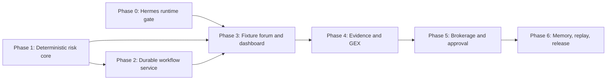

# AI Stock Forum Delivery Roadmap

**Status:** Approved design translated into gated implementation phases

**Source of truth:** [AI Stock Forum design specification](../specs/2026-08-08-ai-stock-forum-design.md)

**Architecture overview:** [architecture.md](../../../architecture.md)

## Why the project is phased

The system combines three very different kinds of risk:

1. deterministic financial calculations that must be reproducible;
2. nondeterministic agent debate through Hermes and a ChatGPT subscription; and
3. sensitive, read-only account data plus a human approval boundary.

Those concerns should not be brought online at the same time. Each phase below
produces working software, has an objective exit gate, and keeps later trust
boundaries disabled until the earlier ones have been proven.

Phase 0 and Phase 1 are parallel foundation tracks. Phase 1 can start now with
synthetic fixtures. The first integrated seven-agent workflow cannot begin until
both foundations pass.

## Non-negotiable constraints across every phase

- The application never previews, stages, submits, replaces, or cancels an
  order. It produces recommendations for explicit human review only.
- Version 1 accepts cash-funded long stock and options whose loss is proven
  finite from the submitted package itself.
- Agent confidence, strategy labels, stop losses, or existing holdings cannot
  substitute for deterministic bounded-loss validation.
- Raw account equity, positions, orders, credentials, and approval reservations
  never enter an LLM prompt.
- `NO_TRADE` is a valid completed recommendation with evidence. Provider, data,
  or mandatory-role failures produce `ANALYSIS_INCOMPLETE`, not `NO_TRADE`.
- Every live trust boundary fails closed. A missing or unsupported exposure
  yields zero approval capacity.
- Every phase uses synthetic or recorded fixtures before its corresponding live
  adapter is enabled.

## Phase 0 — Hermes, Podman, and ChatGPT subscription feasibility gate

### Working result

A command-line smoke lab starts one, then two, then seven isolated Hermes
gateways in rootless Podman containers and sends tool-free synthetic prompts
through the ChatGPT subscription provider.

### Scope

- Pin a reviewed Hermes image digest and record the supported Hermes version.
- Create seven private profile volumes, bearer keys, loopback ports, and
  provider credential stores.
- Complete supported device authorization separately for each profile that
  requires it.
- Start containers with a read-only root, dropped capabilities, private writable
  mounts, sanitized environment and file descriptors, and provider-only egress.
- Disable terminal, filesystem write, arbitrary network, delegation, scheduling,
  package installation, MCP, and automatic memory writes.
- Prove that a tool-free request admitted with `max_iterations=1` causes one
  model iteration and does not trigger hidden compression, delegation, vision,
  web summarization, or other auxiliary provider calls.
- Measure subscription concurrency behavior, throttling, retry headers, and a
  safe coordinator backoff policy at one, two, and seven gateways.
- Record all results with synthetic prompts only. Do not use market, brokerage,
  account, or personal portfolio data.

### Exit gate

- OAuth credentials persist across a container restart without being shared
  between profiles.
- Each gateway rejects every other profile's bearer key.
- The gateway binds only to its intended loopback port.
- Container inspection proves the required mounts, read-only root, capability
  drops, sanitized environment, and egress policy.
- The structured response contract is stable enough for coordinator-side
  Pydantic validation.
- The one-request/one-model-iteration assumption is demonstrated for the pinned
  Hermes version.
- A documented admission limit and backoff policy works for seven profiles.

### Stop condition

If the pinned Hermes version cannot use the user's ChatGPT subscription through
supported device authorization, or if provider-call behavior cannot be bounded,
stop and revise the provider architecture. Do not silently switch to paid API
keys.

### Current prerequisite status

As of 2026-08-09, Docker is installed locally, but `hermes` and `podman` are not.
The production design still requires rootless Podman. Installation and device
authorization require explicit user participation before this gate can finish.

### Deferred

Agent personas, web research, GEX, brokerage, debate orchestration, persistence,
and the dashboard.

## Phase 1 — Deterministic risk core

### Working result

A pure Python library and fixture CLI validate a proposed stock or defined-risk
options package, calculate exact expiration payoff, enumerate operational
exercise/assignment states, and return the maximum quantity allowed by every
configured capacity dimension.

### Scope

- Strict, versioned Pydantic contracts and generated JSON Schema.
- Canonical decimal-string JSON and stable SHA-256 input hashes.
- Cash-funded long stock, long calls and puts, debit and protected credit
  verticals, standard butterflies, iron butterflies, and iron condors.
- Generic payoff proof from signed legs, not trusted strategy labels.
- Mandatory exercise and assignment enumeration, including sequential and
  contrary exercise states.
- Conservative event, expiration, pin, deliverable, liquidity, and freshness
  gates from fixture inputs.
- Multi-dimensional sizing for expiration loss, entry and cumulative cash,
  buying power, gross purchase cash, temporary long/short shares, temporary
  stock notional, gross settlement notional, symbol concentration, and sector
  concentration, plus explicit aggregate-defined-risk and long-stock-allocation
  policy ceilings.
- Existing positions, open orders, and active reservations represented as
  separately normalized committed-capacity vectors.
- A reservation draft only; no persistent reservation is created in this phase.

Implementation is deliberately staged: stock and long options first, verticals
second, then butterflies and iron structures after the payoff and lifecycle
kernels pass property tests.

### Exit gate

- Identical fixtures produce byte-identical risk results and rule ordering.
- Hand-calculated golden cases pass for every allowed structure.
- Property tests prove leg-order invariance, strike continuity, bounded-loss
  detection, exact bounded risk/cash arithmetic, declared conservative monetary
  rounding, deterministic breakeven presentation, and capacity monotonicity.
- Naked shorts, uncovered ratios, adjusted contracts, mixed expirations,
  nonstandard deliverables, legged entries, and unsupported exposures fail
  closed with stable reason codes.
- Operational states cover every leg event count and retain gross settlement
  exposure even when net shares are zero.
- The CLI has no network, database, Hermes, MCP, broker, or wall-clock access.

### Detailed execution plan

See [Phase 1 deterministic risk-core implementation plan](2026-08-09-phase-1-deterministic-risk-core.md).

### Deferred

Live quotes, broker-specific margin parity, Greeks, volatility models,
probability estimates, persistent reservations, API, UI, and agent judgment.

## Phase 2 — Durable contracts and workflow service

### Working result

A FastAPI service runs a canned fixture through a persisted workflow, streams
progress over server-sent events, and reconstructs the complete run from SQLite.
Agents remain fake and deterministic.

### Scope

- Add the remaining principal contracts: `AnalysisRequest`,
  `EvidenceQueryPlan`, `EvidenceEnvelope`, `EvidenceItem`, `SpecialistBrief`,
  `RecommendationVersion`, `UserDecision`, and durable
  `CapacityReservation`.
- Add SQLite with Alembic migrations and append-only audit events.
- Implement the legal state machine and explicit outcome/state/decision
  separation.
- Provide FastAPI endpoints for request creation, run retrieval, cancellation,
  SSE events, and fixture-only recommendation retrieval.
- Persist exact input hashes, schema/engine versions, transitions, retries, and
  supersession links.
- Use a deterministic fake gateway; do not call Hermes yet.

### Exit gate

- Illegal transitions, duplicate decisions, and retries past their limits are
  rejected.
- Restart and supersession tests reconstruct the same current state from the
  audit log.
- SSE reconnects from the last event ID without duplicating events.
- A saved `RiskAssessment` is hash-linked to the exact candidate and fixtures
  that produced it.
- The service binds only to loopback and exposes no approval or order endpoint.

### Deferred

Real Hermes, real evidence, real account state, approval, memory retrieval, and
production dashboard behavior.

## Phase 3 — Complete fixture-only seven-agent forum and dashboard

### Working result

The local React/FastAPI application runs the entire seven-specialist debate
against recorded or synthetic evidence. It defaults to fake gateways and may
use fake gateways for repeatable tests, while the phase exit requires the pinned
Phase 0 Hermes gateways with nonsensitive fixtures.

### Scope

- Implement the fixed seven profiles: fundamental/catalyst, technical/GEX, bull,
  bear, options strategist, risk/liquidity officer, and neutral moderator.
- Freeze one shared evidence envelope per debate and derive role-scoped
  projections.
- Collect independent briefs, construct candidates, perform one bounded
  cross-examination/repair round, run the risk gate, and moderate the result.
- Enforce the shared provider admission controller across all profiles.
- Keep fake gateways as the default automated-test boundary, then run one full
  seven-role workflow through the seven real pinned Hermes profiles using only
  synthetic/recorded nonsensitive evidence.
- Render phase status, agent briefs, cited evidence, candidate comparison,
  payoff/risk calculations, dissent, and terminal outcome in React.
- Keep the approval control visible but disabled in all fixture modes.

### Exit gate

- Golden `TRADE`, `NO_TRADE`, `SPLIT_DECISION`, and
  `ANALYSIS_INCOMPLETE` workflows pass.
- A schema-invalid agent response receives one structured repair opportunity
  and otherwise fails the mandatory role.
- The coordinator—not an agent—controls transitions, retries, cancellation,
  input freezing, risk admission, and persistence.
- Missing mandatory roles, stale evidence, provider interruption, and changed
  evidence envelopes produce the specified failure semantics.
- Browser tests prove approval stays disabled for every non-approvable state.
- A real-Hermes end-to-end fixture run produces all seven validated briefs,
  bounded repair behavior, deterministic risk admission, moderation, SSE events,
  and an auditable terminal result without fallback to fake gateways.

### Deferred

Live evidence, GEX, account data, approval, outcome memory, and remote access.

## Phase 4 — Controlled public evidence and GEX

### Working result

The forum can analyze current public market evidence and non-account GEX through
coordinator-owned acquisition adapters while all account constraints remain
synthetic.

### Scope

- Typed, allowlisted query plans; agents cannot submit arbitrary URLs or
  operations.
- Market/news/filing/option-chain evidence adapters with immutable normalized
  envelopes, provenance, timestamps, trust tiers, and content hashes.
- Read-only GEX MCP adapter exposing only approved non-account methods.
- Source-tier and corroboration rules for material claims.
- SSRF, DNS-rebinding, redirect, content-type, response-size, credential
  forwarding, prompt-injection, and schema-drift defenses.
- Quote/event freshness policies passed into the deterministic risk engine.

### Exit gate

- Every material factual claim resolves to saved, timestamped evidence.
- Agents receive only normalized role projections, never raw fetched content or
  credentials.
- Source failures and contradictory/stale evidence have explicit terminal or
  partial-data semantics.
- GEX absence cannot be misrepresented as a directional signal.
- Replay mode cannot access any live adapter.
- At least one opt-in canary combines real pinned Hermes with current allowlisted
  public evidence and GEX, persists its provenance, and passes the same contract
  and risk gates. It contains no account data and cannot fall back to a fake
  gateway while satisfying this exit check.

### Deferred

Live brokerage/account data and approval. If GEX shares brokerage credentials or
a write-capable server surface, it remains fixture-only until Phase 5 isolates a
safe acquisition boundary.

## Phase 5 — Read-only brokerage, recommendation integrity, and approval

### Working result

The user can review a specific trade plan and explicitly approve or reject its
exact immutable version after a fresh account and quote check. Approval records
intent only; no order can be sent.

### Scope

- Coordinator-only, read-only account acquisition and conservative position/open
  order normalization.
- Proof that configured servers and application routes expose no broker-write
  capability.
- Redacted, recorded account fixtures before an opt-in live canary.
- Pre-approval quote, event, policy, account, engine, and recommendation refresh.
- Hash-bound `UserDecision` records and supersession on every material change.
- Atomic, multi-dimensional capacity reservations in SQLite.
- Fresh, unambiguous reconciliation before reservation release.
- Browser responses limited to account fields needed for the user's risk review.

### Exit gate

- Unsupported positions or unparseable orders force approval capacity to zero.
- Concurrent approvals cannot overspend any capacity dimension.
- A stale or changed recommendation hash cannot be approved from another tab or
  process.
- Raw account data and credentials are absent from agent prompts, audit logs,
  browser payloads beyond the approved review projection, and exception traces.
- Static route/tool inventory and integration tests prove there is no order
  preview, staging, submission, replacement, or cancellation path.

### Deferred

Broker execution permanently remains outside version 1.

## Phase 6 — Hybrid memory, replay, and release hardening

### Working result

A local release candidate has stable personas, isolated per-run context,
append-only outcome scorecards, bounded historical retrieval, deterministic
fixture replay, observability, and a hardened launcher.

### Scope

- Durable application memory for runs, recommendations, decisions,
  reservations, outcomes, and evaluation metadata.
- Profile-private memory limited to stable instructions and explicitly approved
  preferences; no automatic historical write-back.
- Bounded retrieval of prior evidence-grounding and calibration scorecards with
  strict `as_of` filtering.
- Replay harness with every live adapter disabled and saved deterministic inputs
  reproduced exactly.
- Structured metrics for latency, rate limits, validation repairs, risk rule
  failures, evidence freshness, and redaction events.
- Failure/chaos tests, backup/restore, dependency locking, local launcher, and
  an acceptance-criteria demonstration script.

### Exit gate

- Replay cannot reach live tools or evidence newer than its `as_of` boundary.
- Memory cannot mutate historical records or fixed persona definitions.
- Redaction and security suites pass with synthetic secrets and account fields.
- All 19 acceptance criteria in the design specification have executable
  demonstrations.
- The supported workflow remains local, loopback-only, and requires no Redis,
  Kafka, Celery, remote database, or public deployment.

### Deferred extensions

Scheduled scans, richer analytics, remote or multi-user access, alternative
providers, multi-expiration strategies, broker execution, and automatic trading.

## Acceptance-criteria traceability

The numbered rows refer to Section 18 of the approved design specification.

| Criterion | Owning phase | Demonstration |
|---:|---|---|
| 1 | 1, 5 | Finite-loss payoff proof plus assignment/exercise capacity gate |
| 2 | 1 | Byte-stable fixture calculation and golden replay |
| 3 | 2, 3, 5 | State machine and UI cannot bypass the risk result |
| 4 | 3 | Missing mandatory role yields `ANALYSIS_INCOMPLETE` |
| 5 | 3, 4 | `NO_TRADE` preserves evidence and failed thresholds |
| 6 | 4 | Every material claim resolves to saved evidence |
| 7 | 3, 5 | Exact package, lifecycle, quantity, and risk review projection |
| 8 | 5 | Approval refresh and supersession on every material change |
| 9 | 2–6 | Append-only events reconstruct workflow, debate, tools, calculations, and decision; Phase 6 runs the end-to-end proof |
| 10 | 6 | Replay disables live tools and enforces the original `as_of` |
| 11 | 5 | Atomic multi-dimensional capacity reservations |
| 12 | 0, 5 | Capability inventory proves no order-write surface |
| 13 | 0 | Rootless profile isolation and forbidden-capability tests |
| 14 | 3, 5 | Role projections and redaction keep account data out of prompts |
| 15 | 5 | Unsupported positions/orders force capacity to zero |
| 16 | 4 | Typed allowlisted queries and corroboration policy |
| 17 | 5 | Fresh unambiguous reconciliation before reservation release |
| 18 | 0 | Private device authorization and one-iteration proof |
| 19 | 6 | Local loopback workflow without distributed infrastructure |

## Recommended execution order

Start with Phase 1 because it requires no missing local prerequisite and yields
the reusable safety kernel for every later workflow. In parallel, prepare Phase
0, but pause when Podman installation or ChatGPT device authorization requires
the user. Phase 2 may begin as soon as Phase 1 passes and may continue while
Phase 0 is being completed. Phase 3 is the join gate: it cannot exit until
Phases 0, 1, and 2 all pass. Proceed numerically from Phase 3 onward.

No later phase should weaken an earlier gate. New option structures, adapters,
or approval behavior must enter through the same contracts and tests rather
than bypassing them.
