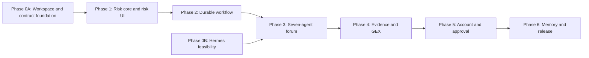
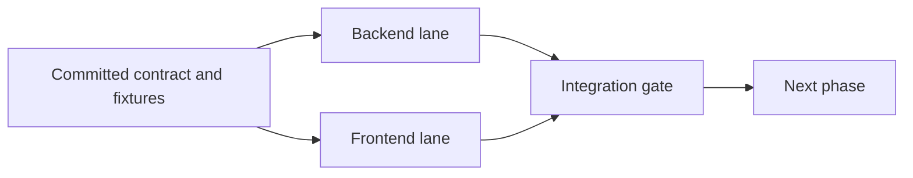

# AI Stock Forum Delivery Phases

**Status:** Approved backend/frontend delivery design

**Updated:** 2026-08-10

**Architecture:** [architecture.md](architecture.md)

**Normative design:** [AI Stock Forum design specification](docs/superpowers/specs/2026-08-08-ai-stock-forum-design.md)

**Detailed risk plan:** [Phase 1 deterministic risk-core plan](docs/superpowers/plans/2026-08-09-phase-1-deterministic-risk-core.md)

## Purpose

This is the canonical delivery map for version 1. It keeps the backend and
frontend in separate folders and develops them as parallel, contract-first
tracks. Each numbered phase has an independent backend result, an independent
frontend result, and an integration gate that both must pass.

The normative product and safety requirements remain in the design
specification. The detailed risk-core plan remains the implementation reference
for the financial kernel, but its paths must be updated from root-level
`src/` and `tests/` locations to `backend/src/` and `backend/tests/` before it
is executed.

## Repository boundary

```text
ai-stock-forum/
├── backend/
│   ├── pyproject.toml
│   ├── src/ai_stock_forum/
│   │   ├── api/             # FastAPI routes, schemas, and SSE transport
│   │   ├── risk/            # Pure deterministic financial calculations
│   │   ├── workflow/        # Debate state machine and coordination
│   │   ├── agents/          # Hermes gateway clients and role orchestration
│   │   ├── evidence/        # Market, GEX, and account acquisition adapters
│   │   └── persistence/     # SQLite models, repositories, and migrations
│   └── tests/
├── frontend/
│   ├── package.json
│   ├── src/
│   │   ├── api/             # Generated client, transport, and mock handlers
│   │   ├── features/        # Product capabilities grouped by user workflow
│   │   └── components/      # Reusable presentation components
│   └── tests/
├── contracts/
│   ├── openapi.json         # Generated and committed API contract
│   └── fixtures/            # Shared synthetic requests, events, and results
├── infrastructure/
│   └── hermes/              # Local profile and container definitions
├── docs/
├── architecture.md
└── phases.md
```

The backend owns financial calculations, validation, workflow transitions,
evidence acquisition, persistence, and authorization decisions. The frontend
renders backend results and sends typed commands. It must not duplicate payoff,
sizing, freshness, approval-validity, or workflow-transition logic.

`contracts/` is a compatibility boundary, not a third application. Pydantic
models in the backend are the source of truth. They generate `openapi.json`,
which generates the frontend TypeScript client and types. Shared fixtures let
the frontend advance against deterministic mocks while backend features are
still being built.

## Dependency map

Phase 0 contains two parallel gates. Phase 0A establishes the repository and
contract seam. Phase 0B proves the real Hermes/ChatGPT/Podman path. Phase 0B
does not block the deterministic risk engine or fake-agent workflow, but it must
pass before the real-Hermes forum in Phase 3 can exit.



Within each phase, the two implementation lanes converge at an integration
gate:



## Rules that apply to every phase

- Version 1 recommends trades but cannot preview, stage, transmit, replace, or
  cancel a brokerage order.
- The user must approve the exact immutable recommendation version. Approval is
  a recorded decision, not order execution.
- Only cash-funded long stock and deterministically proven defined-risk options
  structures may pass the risk gate.
- `NO_TRADE` is a valid, evidence-backed result. Missing mandatory inputs or
  infrastructure produce `ANALYSIS_INCOMPLETE`.
- Raw account data and credentials never enter an LLM prompt or browser payload.
- Every live adapter is preceded by synthetic or recorded fixtures and fails
  closed when required inputs are unavailable or unparseable.
- Backend and frontend tests can run independently. A numbered phase is not
  complete until its shared integration gate also passes.
- Contracts change through backend model changes, regenerated artifacts, and
  compatibility review. Neither side edits generated contract code by hand.

## Phase 0 — Workspace, contracts, and Hermes feasibility

### User-visible result

One local development command can start a minimal backend and frontend. The
browser displays backend health through a generated client. Separately, a
synthetic smoke lab proves whether seven isolated Hermes profiles can use the
approved ChatGPT subscription path safely enough for later phases.

### Backend lane: Phase 0A

- Create the `backend/` Python project with `uv`, FastAPI, Pydantic, pytest,
  Hypothesis, Ruff, and mypy.
- Add a versioned `/api/v1/health` endpoint with no database or external calls.
- Add deterministic OpenAPI export into `contracts/openapi.json`.
- Add a contract-drift check that fails when generated output differs from the
  committed artifact.
- Keep all runtime configuration typed and fail fast on invalid values.

### Frontend lane: Phase 0A

- Create the `frontend/` React, TypeScript, and Vite project using npm.
- Generate the TypeScript API client from `contracts/openapi.json`.
- Add a health screen with loading, success, incompatible-version, and
  unreachable-backend states.
- Add MSW-based mock transport so component and browser tests do not require the
  backend process.
- Configure Vite to proxy `/api` and `/events` to the loopback backend.

### Infrastructure lane: Phase 0B

- Pin a reviewed Hermes version and container image digest.
- Install and initialize rootless Podman with explicit user participation.
- Create seven isolated profiles, private credential volumes, bearer keys, and
  loopback-only ports.
- Complete supported `openai-codex` device authorization separately for every
  profile that requires it; never copy refresh credentials between profiles.
- Disable terminal, file-write, installation, scheduling, delegation,
  arbitrary-network, MCP, and automatic-memory-write capabilities.
- Measure concurrency, rate-limit, retry, and provider-call behavior with
  synthetic tool-free prompts only.

### Phase 0A integration gate

- Backend tests, lint, type checks, and package build pass independently.
- Frontend tests, lint, type checks, and production build pass independently.
- Regenerating OpenAPI and the TypeScript client produces no uncommitted diff.
- The browser obtains health from the real backend and the same screen passes
  against MSW mocks.

Passing this gate unblocks Phases 1 and 2 even if Phase 0B is still waiting for
user-assisted installation or authorization.

### Phase 0B feasibility gate

- Hermes credentials survive restart without profile sharing; bearer-key,
  loopback, mount, capability, and egress isolation checks pass.
- A documented admission limit safely handles all seven profiles.

Passing this gate is required before Phase 3 can claim a real-Hermes exit.

### Stop condition

If Hermes cannot use the user's ChatGPT subscription through its supported
device authorization, or provider calls cannot be bounded, stop the Hermes
track and revise the provider architecture. Do not silently switch to API-key
billing. Phase 1 and the fake-agent portion of Phase 2 may continue.

## Phase 1 — Deterministic risk core and risk-result UI

### User-visible result

Synthetic stock and options candidates produce byte-stable `PASS`, `REJECT`,
or `INCOMPLETE` results. The frontend can inspect their payoff, capacity,
liquidity, lifecycle, and rule evidence from shared golden fixtures.

### Backend lane

- Implement strict versioned risk input and output contracts.
- Implement canonical decimal serialization, hashes, and deterministic result
  identifiers.
- Support cash-funded long stock, long calls and puts, four verticals, standard
  butterflies, iron butterflies, and iron condors.
- Prove bounded expiration loss from actual signed legs rather than strategy
  labels.
- Enumerate mandatory assignment and exercise states and retain gross exposures
  even when net shares or cash cancel.
- Size quantity across loss, cash, buying power, settlement, temporary stock,
  concentration, aggregate-risk, and long-stock-allocation limits.
- Ship a pure fixture CLI with no network, database, Hermes, MCP, broker, clock,
  or environment dependency.

### Frontend lane

- Build reusable payoff-summary, risk-rule, capacity, liquidity, and lifecycle
  panels from versioned golden outputs.
- Render exact option legs, quantities, expirations, strikes, actions, entry
  bounds, maximum loss/profit, breakevens, and binding capacity dimensions.
- Distinguish failed, unknown, and not-applicable rules without changing their
  backend ordering or severity.
- Provide fixture selection for all allowed structures and important failure
  states; do not imply that fixture results are live recommendations.
- Add keyboard, screen-reader, narrow-screen, and monetary-format coverage.

### Integration gate

- Every allowed structure passes hand-calculated golden and property tests.
- Unsupported or unbounded structures fail closed with stable reason codes.
- The frontend renders every committed golden result without handwritten API
  types or financial recomputation.
- Contract fixtures validate against the current backend schema and frontend
  generated types.

## Phase 2 — Durable workflow service and live run UI

### User-visible result

A user can start a canned analysis, watch deterministic fake agents progress in
real time, reconnect without duplicated events, and reopen the complete run
after the application restarts.

### Backend lane

- Add FastAPI commands and queries for creating, cancelling, and retrieving a
  run.
- Add SQLite, SQLAlchemy, Alembic, append-only audit events, and deterministic
  fake agent gateways.
- Implement the legal state machine and keep workflow state, analytical outcome,
  and human decision as separate concepts.
- Stream ordered SSE events with stable IDs and replay from `Last-Event-ID`.
- Hash-link every risk result to the exact candidate, policy, evidence fixture,
  and engine version.

### Frontend lane

- Add the analysis request form and saved-run navigation.
- Add a live phase timeline, reconnect behavior, cancellation feedback, and
  terminal-state views.
- Render fake specialist briefs, candidates, deterministic risk results, and
  audit metadata through the generated client.
- Keep approval controls disabled and clearly label the workflow as fixture
  mode.

### Integration gate

- A complete canned workflow works through the real API and SQLite database.
- Restart, retry, cancellation, supersession, and SSE reconnect tests pass.
- Illegal transitions and duplicate commands fail with stable contract errors.
- Playwright verifies that refreshing or reconnecting does not duplicate or
  reorder the visible debate timeline.

## Phase 3 — Complete fixture-only seven-agent forum

### User-visible result

The dashboard runs the full seven-role debate using synthetic or recorded
evidence, displays dissent and candidate comparisons, and concludes with
`TRADE`, `NO_TRADE`, `SPLIT_DECISION`, or `ANALYSIS_INCOMPLETE`.

### Backend lane

- Implement the seven fixed roles: fundamental/catalyst, technical/GEX, bull,
  bear, options strategist, risk/liquidity, and neutral moderator.
- Freeze one immutable evidence envelope and derive role-scoped projections.
- Orchestrate independent briefs, candidate construction, targeted challenges,
  one bounded repair round, deterministic risk admission, and moderation.
- Enforce a shared provider admission controller across all Hermes profiles.
- Retain deterministic fake gateways for automated tests and replay.

### Frontend lane

- Add distinct role panels without allowing personality to obscure source or
  confidence information.
- Add evidence-linked briefs, challenge/rebuttal views, candidate comparison,
  deterministic risk details, dissent, and final moderation rationale.
- Show missing-role and invalid-response failures as
  `ANALYSIS_INCOMPLETE`, never as consensus or `NO_TRADE`.
- Keep approval disabled for all fixture workflows.

### Integration gate

- Golden workflows cover all four terminal analytical outcomes.
- Invalid agent output gets one structured repair attempt and then fails the
  mandatory role.
- The coordinator, not an agent, controls transitions, retries, evidence
  freezing, risk admission, and persistence.
- One nonsensitive end-to-end fixture run uses all seven real pinned Hermes
  gateways without falling back to fake agents.

## Phase 4 — Controlled public evidence and read-only GEX

### User-visible result

The forum can analyze current public market evidence and GEX, with every
material factual claim linked to saved provenance and freshness information.
Account limits remain synthetic.

### Backend lane

- Add typed, allowlisted market, news, filing, option-chain, and GEX acquisition
  adapters owned by the coordinator.
- Normalize evidence into immutable envelopes with timestamps, trust tiers,
  hashes, and citation identifiers.
- Add source corroboration, freshness, redirect, SSRF, content-type, response
  size, credential-forwarding, prompt-injection, and schema-drift defenses.
- Pass quote and event freshness inputs into the deterministic risk engine.
- Ensure replay mode cannot access any live source.

### Frontend lane

- Add evidence cards, citations, source tiers, observed times, freshness status,
  contradiction warnings, and role-to-evidence traceability.
- Add clearly timestamped GEX levels and an explicit unavailable state.
- Make stale or insufficient evidence visibly different from a bearish or
  neutral interpretation.

### Integration gate

- Every material claim resolves to persisted evidence visible in the browser.
- Agents receive normalized projections rather than raw fetched content or
  credentials.
- Missing GEX cannot be converted into a directional signal.
- An opt-in canary combines real Hermes, current public evidence, and read-only
  GEX without account data or fake-gateway fallback.

## Phase 5 — Read-only account context and exact-plan approval

### User-visible result

The user can review and approve, reject, or watchlist an exact immutable trade
plan after the backend refreshes quotes and read-only account constraints.
Approval records intent only and cannot place an order.

### Backend lane

- Add coordinator-only read-only account acquisition and conservative
  normalization of positions and open orders.
- Prove by route and capability inventory that no order-write operation exists.
- Refresh quotes, events, policy, account commitments, and risk immediately
  before accepting a decision.
- Bind decisions to the recommendation content hash and supersede every
  materially changed version.
- Atomically reserve all capacity dimensions in SQLite and release only after
  fresh, unambiguous read-only reconciliation.

### Frontend lane

- Add the exact package review: thesis, legs, entry, quantity, maximum loss and
  profit, breakevens, capacity use, exits, catalysts, citations, dissent, and
  freshness.
- Add explicit approve, reject, and watchlist actions with confirmation of the
  exact content hash.
- Show refresh, supersession, expiration, reservation, conflict, and
  re-approval states without silently updating the plan being reviewed.
- Expose only the minimum account-derived risk projection required for the
  user's decision.

### Integration gate

- Unsupported positions or orders force approval capacity to zero.
- Concurrent approvals cannot overspend any capacity dimension.
- A stale or changed recommendation cannot be approved from another tab or
  process.
- Raw account records and credentials are absent from prompts, audit payloads,
  browser responses, and exception traces.
- Static inventory and integration tests prove no preview, stage, submit,
  replace, or cancel path exists.

## Phase 6 — Hybrid memory, replay, and local release

### User-visible result

The local release has stable personas, isolated run context, append-only outcome
history, bounded historical retrieval, deterministic replay, observable failure
states, and one supported launcher.

### Backend lane

- Persist runs, recommendation versions, decisions, reservations, outcomes, and
  evaluation metadata without rewriting historical records.
- Keep stable persona memory separate from per-run context and outcome memory.
- Add bounded, `as_of`-safe retrieval of prior evidence-grounding and
  calibration summaries.
- Add replay with every live adapter disabled.
- Add structured metrics, redaction checks, failure injection, backup/restore,
  dependency locking, and release configuration.

### Frontend lane

- Add recommendation history, immutable prior debate views, outcome scorecards,
  replay indicators, and recovery/error states.
- Clearly distinguish historical evidence from current evidence.
- Build the production bundle into `frontend/dist/` for same-origin serving by
  FastAPI.

### Integration gate

- Replay cannot reach live tools or evidence newer than its original `as_of`.
- Memory cannot mutate historical debates or fixed role definitions.
- The complete redaction, security, recovery, browser, and acceptance suites
  pass.
- One launcher serves the built frontend, API, and SSE stream on a loopback-only
  URL without Redis, Kafka, Celery, or a remote database.

## Contract and runtime flow

1. Backend Pydantic models generate the committed OpenAPI artifact.
2. The frontend generator produces TypeScript types and the API client.
3. The frontend sends a versioned REST command with an idempotency key.
4. The backend validates and persists the command, then returns the run or
   resource identifier.
5. The frontend subscribes to ordered SSE events and reconnects from the last
   event ID.
6. The backend emits an immutable recommendation containing evidence, policy,
   calculation, engine, configuration, and content hashes.
7. The frontend displays those values without recomputing or reclassifying
   them.

Errors use a stable problem envelope containing a machine-readable code, a safe
message, retryability, a correlation ID, and optional field details. Transport
failures remain separate from analytical outcomes:

- `REJECT`: a candidate failed a deterministic rule.
- `NO_TRADE`: analysis completed and the evidence did not justify a trade.
- `SPLIT_DECISION`: analysis completed with unresolved material disagreement.
- `ANALYSIS_INCOMPLETE`: required evidence, a mandatory role, or infrastructure
  was unavailable.

## Development and release model

During development, `uv` runs the backend and Vite runs the frontend. Vite
proxies `/api` and `/events` to the backend. MSW serves the same committed
fixtures when a frontend test or isolated UI session does not run the backend.

For a local release, React builds to `frontend/dist/`. FastAPI serves the static
bundle, API, and SSE stream from one loopback origin. The codebases remain
separate even though the user gets one launcher and one URL.

## Verification model

Every phase maintains four gates:

1. **Backend:** pytest unit, property, golden, integration, formatting, lint,
   typing, and coverage checks.
2. **Frontend:** Vitest, Testing Library, accessibility, state, formatting,
   lint, typing, build, and Playwright checks against mocks.
3. **Contract:** OpenAPI regeneration, generated-client drift, shared-fixture
   schema validation, and compatibility checks.
4. **Integrated:** Playwright against the real backend using fake agents first,
   followed only where required by an explicit live Hermes or data canary.

No backend task is blocked by pixel-level frontend work, and no frontend task is
blocked by an unfinished backend implementation when a committed contract and
fixture exist. Neither lane may claim the numbered phase complete by itself.

## Immediate implementation sequence

1. Write the test-driven Phase 0A implementation plan for the monorepo scaffold,
   health contract, generated client, mock transport, and health screen.
2. Update the existing risk-core implementation plan so every source and test
   path lives under `backend/` and every shared fixture path lives under
   `contracts/fixtures/` where appropriate.
3. Execute Phase 0A and verify the backend, frontend, contract, and real-process
   health gates.
4. Begin Phase 1 backend risk work and Phase 1 frontend golden-fixture components
   as parallel tracks.
5. Run Phase 0B in parallel, pausing only for Podman installation and ChatGPT
   device authorization that require the user.

Implementation must not skip the Phase 0A contract seam by independently
inventing backend and frontend schemas.
