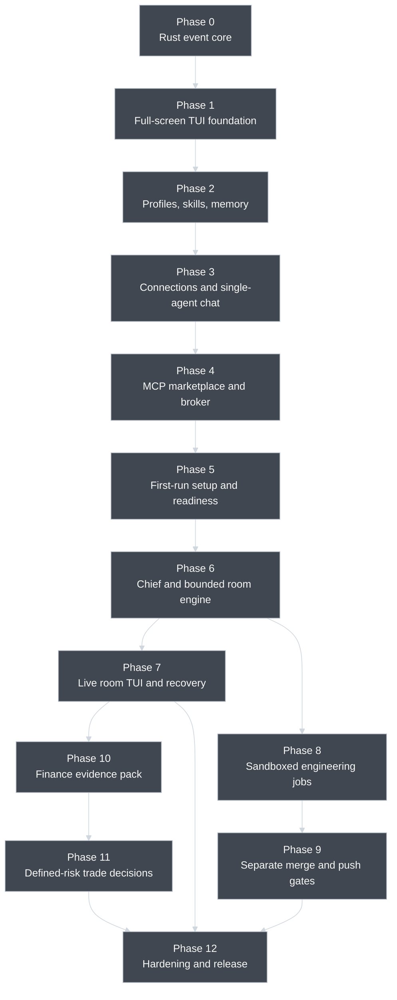

# AI Stock Forum — Agent Platform Delivery Phases

**Status:** Approved version 1 roadmap, including the full-screen TUI,
first-run configuration, and live-participation design

**Updated:** 2026-08-30

**Canonical design:** [architecture.md](architecture.md)

This roadmap replaces the previous Python backend, React frontend, and
Hermes-first phase plans. Older plans are historical context only and must not
be executed without being rewritten against the current architecture.

**Repository warning:** the current README and older files under
`docs/superpowers/` still contain executable-looking legacy instructions. Until
Phase 0 adds superseded banners or moves them to history, do not use them as a
plan or source of truth.

## 1. How this roadmap is organized

Version 1 is a single Rust full-screen terminal application, so it is not
divided into separately deployed frontend and backend projects. The integrated
TUI is the primary client and line-oriented command mode is a fallback adapter.
Every phase is a **vertical slice**: it adds the typed commands and events, TUI
view, fallback command path, application behavior, policy checks, persistence,
adapter boundary, audit events, and tests needed for one usable capability.

The internal boundaries still matter:

```text
full-screen TUI or fallback command mode
                    ↓ typed command
             application service
                    ↓
       policy/domain logic and adapters
                    ↓ committed event
        persistence and UI projection
```

Neither presentation adapter owns business rules or calls a provider, MCP, or
repository directly. A future client can use the same application service
without rebuilding permissions, risk calculations, or workflow transitions.

### Phase rules

Every phase must:

1. preserve all safety invariants in [architecture.md](architecture.md);
2. receive a new canonical, user-approved, test-driven implementation plan before
   code work starts; an obsolete plan may never be reused by path substitution;
3. divide large adapter, transport, host, or risk work into independently gated
   milestones inside that phase plan;
4. start each milestone with failing tests for the behavior being added;
5. work offline with fake providers, runtimes, MCPs, and synthetic finance data;
6. keep paid-provider/live-runtime tests out of the default suite, while still
   requiring release conformance for every advertised integration;
7. include migrations and recovery behavior for new durable state;
8. emit typed, redacted audit events for sensitive actions;
9. fail closed rather than silently use a more permissive path;
10. update user help and architecture notes when an interface changes; and
11. test user-visible behavior through headless view models plus the fallback
    command adapter, without requiring an actual terminal; and
12. pass its exit gate before the next dependent phase begins.

No phase may introduce a VM, unrestricted coding mode, broker execution,
automatic merge/push, community MCP installation, or agent-controlled permission
change.

## 2. Dependency map

The roadmap is intentionally top-to-bottom and uses the same high-contrast grey
palette as the architecture diagrams so it remains readable while scrolling on
a phone or viewing the document on a dark background.



Discussion-agent inference uses only the three direct-provider adapters in
version 1. The normalized inference contract remains provider-neutral so a
future external runtime can be designed without changing the room coordinator.

## 3. Cross-phase architecture decisions

These choices are already approved and should not be reopened inside an
implementation phase unless new evidence shows they are impossible:

- one Rust modular monolith with an integrated event-driven core;
- a full-screen TUI as the primary version 1 client and line-oriented command
  mode as a fallback/recovery/test adapter over the same commands and events;
- OpenAI, Anthropic, and xAI direct-provider adapters as the only version 1
  discussion-agent inference paths;
- a normalized inference contract that preserves a post-version-1 extension
  seam without implementing an external agent runtime;
- a deterministic, resumable first-run setup with Quick Start and Customize
  paths backed by the same typed commands, schema, validation, and audit events;
- versioned built-in Quick Start templates that never invent credentials,
  enable provider fallback, or grant MCP access by default;
- immutable applied installation configurations, editable only by creating and
  reviewing a new setup draft/version through `/setup` or Settings;
- capability-specific readiness: missing configuration disables only the
  dependent operation with an explanation and never triggers a silent fallback;
- credential values flow directly to the operating-system secret broker, while
  setup drafts, projections, snapshots, and audits contain opaque references;
- Chief of Staff as a policy-constrained coordinator, with the user above it;
- versioned agent profiles, skills, memory, policy, and approvals;
- user-approved internal MCP entries and lazy per-turn tool-schema loading;
- coordinator-mediated, bounded agent discussions with one visible speaker and
  only one auto-running live room at a time;
- concurrent bounded evidence/MCP research may update status, but conversational
  inference launches serially and publishes into one shared transcript;
- non-preemptive human messages: `@Name` targets one agent, `@all` creates
  ordered obligations, unaddressed input routes to the Chief at the next safe
  turn boundary, and multiple messages are handled FIFO by durable event ID;
- a human intervention closes an unfinished sealed first-pass batch; unstarted
  obligations are replanned after the routed human turn from a new sealed
  snapshot rather than running with stale input;
- automatic continuation by default, with user pause, resume, step, explicit
  cancel, and explicit finite budget overrides at any time;
- each finite room cap contains a protected closing allowance; every metered
  call must fit a conservative reservation before launch, actual use is
  reconciled afterward, and exhausted queued input enters `AwaitingExtension`;
- durable numbered room events, rebuildable checkpoints, bounded per-agent
  context reconstruction, `PartialMessage` retry-or-skip recovery, and distinct
  deterministic `PartialRoomResult` fallback;
- closing or losing the TUI requests a pause, cancels or joins background work,
  and starts no new turn; only the already-visible response may drain in the
  foreground process during handled graceful shutdown, and there is no
  background room daemon in version 1;
- Codex CLI or Claude Code selected by the user for each engineering profile/job;
- strict built-in runtime sandbox plus an isolated Git worktree;
- hard refusal if the required sandbox is unavailable;
- no VM and no unrestricted or bypass mode;
- one exact approval for merge and a later, separate exact approval for push;
- deterministic finance validation and defined-risk recommendations only; and
- no broker order interface in version 1.

## Phase 0 — Rust foundation and typed event core

### Objective

Create the smallest durable Rust application core that can accept typed commands,
persist state, emit application/audit events, and recover cleanly after restart
without depending on a terminal renderer.

### User-visible result

The user can start one executable in fallback command mode, run `/help`,
`/status`, `/setup status`, `/audit tail`, and `/quit`, and restart without
losing the local installation identity or event history. The same use cases
pass headlessly through typed commands and events for the Phase 1 TUI.

### Scope

- Before code changes, update the README to point at these canonical documents
  and place a prominent `SUPERSEDED — DO NOT EXECUTE` banner on every legacy
  spec/plan, or move it under an explicit history directory while preserving Git
  history.
- Establish the Rust toolchain policy, formatting, linting, test, and build
  commands.
- Create module boundaries for TUI and fallback command presentation, app,
  policy, persistence, audit, recovery, agents, rooms, adapters, jobs, and domain
  packs.
- Define typed application commands, application events, correlation IDs,
  bounded channels, and deterministic reducers/view projections before a
  full-screen renderer exists.
- Implement a minimal line-oriented fallback mode with structured command
  parsing and clear text rendering.
- Add an application command/event boundary so neither presentation adapter can
  call storage or adapters directly.
- Define stable IDs, timestamps, object versions/digests, typed errors, and
  normalized event envelopes.
- Add SQLite migrations, transactions, owner-only local state permissions, and
  an append-only event repository.
- Add installation identity, setup-draft, installation-configuration-version,
  setup-step-outcome, and capability-readiness event/projection skeletons. Phase
  5 supplies the complete guided setup state machine.
- Add configuration discovery using platform-appropriate application directories;
  keep secrets out of configuration and SQLite.
- Add the initial deny-wins capability vocabulary and typed approval record
  skeleton, without sensitive approval actions yet.
- Add clean shutdown, interrupted-operation recovery hooks, terminal-independent
  fake clock/ID support, and deterministic test fixtures.
- Inventory old Python/web artifacts in the detailed Phase 0 plan. Remove or
  archive them only as an explicit reviewed change; do not touch unrelated user
  files merely because they are not part of the target architecture.

### Exit gate

- The README identifies the Rust terminal design as current, and no legacy
  document claims to be approved, canonical, or executable without a superseded
  warning.
- Fresh install, migration, restart, and corrupt/incompatible-database error
  paths are tested.
- Commands flow presentation adapter → application service → repository and
  generate typed events that rebuild the same projection.
- `/setup status` reports that guided setup is not yet implemented without
  inventing readiness or writing an applied configuration.
- Unknown commands and malformed input cannot panic the process.
- `cargo fmt`, strict linting, unit tests, and integration tests pass.
- No Python, Node, browser, provider credential, subscription, or network access
  is required to run the executable or default tests.

### Explicitly deferred

Full-screen rendering, agents, real providers, MCP, discussions, engineering
processes, Git promotion, and finance behavior.

## Phase 1 — Full-screen TUI foundation

### Objective

Make the full-screen TUI the primary executable experience while preserving the
typed application boundary established in Phase 0.

### User-visible result

Launching the executable opens a responsive dark-friendly terminal workspace
with navigation, status, help, audit activity, a command palette, and a composer.
The interface restores the terminal cleanly on exit and adapts to narrower
windows without hiding critical status or actions.

### Scope

- Select and pin the Rust terminal renderer/input dependencies in the detailed
  Phase 1 plan after verifying their current platform and accessibility support.
- Implement alternate-screen/raw-mode lifecycle, bounded input/event pumping,
  resize handling, cursor/focus management, and terminal restoration on normal
  exit, handled signals, and panic paths.
- Build a headless TUI reducer and immutable view model that consume only typed
  application events and submit only typed application commands.
- Add a workspace shell with header/status, primary content, collapsible
  activity/help region, persistent composer, command palette, notifications, and
  contextual key help.
- Add the first-launch setup shell, step navigation, progress, review, and
  interrupted-draft projections using placeholder setup data. Phase 5 connects
  the complete Quick Start/Customize workflow and applies configurations.
- Keep wide layouts useful while collapsing secondary regions into tabs on
  narrow terminals; define and test a supported minimum size and an explicit
  too-small fallback screen.
- Use a high-contrast dark-default palette plus monochrome/no-color mode. Never
  encode status only by color.
- Sanitize or visibly escape control characters and terminal escape sequences in
  every untrusted string before layout or rendering.
- Render `/help`, `/status`, `/audit tail`, settings, and safe quit through the
  TUI while retaining command-mode parity.
- Add deterministic headless snapshots, focus/input tests, resize matrices, and
  pseudo-terminal tests for terminal restoration.

### Exit gate

- Normal startup opens the full-screen TUI; fallback command mode remains an
  explicit option and produces the same committed state/events.
- Help, status, audit, settings, and quit work without presentation code reading
  or writing repositories directly.
- Resize, Unicode/wide characters, long wrapped text, scroll, focus changes, and
  minimum-size handling cannot panic or corrupt terminal state.
- Normal exit, handled interruption, and injected panic restore canonical
  terminal mode in automated tests.
- Dark/high-contrast and monochrome snapshots remain readable, and untrusted
  control sequences cannot alter terminal state or spoof UI chrome.
- Default tests remain offline, deterministic, and usable without an attached
  interactive terminal.

### Explicitly deferred

Complete first-run setup behavior, agent editors, provider chat, MCP views, live
rooms, engineering jobs, Git promotion, and finance-specific screens.

## Phase 2 — Agent profiles, skills, and hybrid memory

### Objective

Let the user define the durable identity and context of an agent without calling
a real model.

### User-visible result

The user can create a Bull, Bear, Chief, or Engineering profile in guided TUI
workspaces; give each a personality and specialty; assign skills; edit private
memory; inspect version history and field-level diffs; and activate a reviewed
profile revision.

### Scope

- Implement immutable `AgentProfileVersion` records and current-version
  projections.
- Add `/agent create|list|show|edit|history` with guided editing, validation,
  field-level diffs, and activation confirmation.
- Add TUI list/detail/editor/history views for profiles, skills, memory, and
  proposals; every action maps to the same typed commands as fallback mode.
- Expose reusable typed draft validators and safe built-in starter-profile
  template versions so Phase 5 can configure agents without a second editor or
  a privileged setup-only write path.
- Support separate inference and optional engineering bindings as references;
  the actual adapters arrive later.
- Implement versioned declarative skill manifests, content, static resources,
  assignment, and compact relevance metadata.
- Ensure skills cannot declare or imply executable capabilities.
- Add `/skill add|list|show|assign|unassign` and plural list aliases.
- Implement agent-private KV memory, direct user edits, agent-originated memory
  proposals, and explicit proposal approval/rejection.
- Implement bounded episodic-summary records linked to source events, without
  automatically treating summaries as facts.
- Add scoped memory/skill retrieval budgets and pin exact versions for a future
  execution.
- Ensure profile duplication does not duplicate or expose secret values.

### Exit gate

- Editing always creates a new version; existing versions and pinned references
  remain immutable.
- Two profiles bound to the same placeholder provider retain different
  personalities, skills, grants, and memory namespaces.
- An agent-authored memory change cannot become durable without user approval.
- A skill cannot add an MCP, provider, filesystem, network, or Git capability.
- Export/editor flows contain no secret fields and reject malformed revisions
  before activation.
- TUI and fallback command mode produce identical profile versions, memory
  proposals, approval events, and validation failures for the same inputs.
- Applying a profile choice from a synthetic setup draft produces the same
  immutable profile version as the normal guided editor.
- Migration, retrieval-budget, isolation, and approval tests pass.

### Explicitly deferred

Real direct-provider model calls, MCP connections, rooms, engineering children,
and finance-specific skills.

## Phase 3 — Connections, normalized inference, and single-agent chat

### Objective

Connect agent profiles to models without coupling orchestration to a vendor or
placing credentials in application data.

### User-visible result

The user can add/test a direct OpenAI, Anthropic, or xAI API connection, bind a
profile to a model, and have a private streaming single-agent conversation in
the TUI. The interface shows connection state, the current draft, usage, errors,
and cancellation without freezing navigation. Plain text can be routed to a
minimally configured Chief profile.

### Scope

- Define the common inference-provider request, structured-output, tool-loop,
  usage, cancellation, and normalized-event contracts.
- Implement a deterministic fake provider for all default tests.
- Add `/connection add|list|test|remove` with connection type, safe account
  label, availability, and secret reference.
- Integrate the operating-system credential store for direct API keys. Never
  persist or display the raw key after entry.
- Represent Codex/Claude engineering-runtime login separately from direct API
  keys for later job bindings. It is not an inference connection. Do not copy,
  export, or reinterpret subscription/session credentials.
- Add direct OpenAI, Anthropic, and xAI adapters behind the same contract.
- Add bounded retries, deadlines, cancellation, output-schema validation,
  redaction, usage reporting, and clear provider-unavailable states.
- Project normalized provider events into TUI connection and single-agent chat
  views. Streaming deltas are draft state until a completed message commits.
- Add guided connection setup/testing and model binding in the TUI with fallback
  command parity and no secret value in any view model or snapshot.
- Expose the same connection/runtime commands, independent test outcomes, and
  rebuildable readiness predicates to setup drafts. Credential entry writes
  directly to the secret broker and returns only an opaque reference.
- Build prompt context from the pinned profile, personality, relevant skill
  versions, scoped memory, and application policy—not from the full database.
- Add a minimal Chief profile template. At this phase it can converse and route
  typed application commands but cannot yet open multi-agent rooms.
- Record normalized request/result metadata without leaking prompt credentials or
  authorization headers.

### Exit gate

- The same contract suite passes for fake, OpenAI, Anthropic, and xAI adapters.
- Default tests use fake transport and contain no network dependency.
- Opt-in live smoke tests work only for connections the user has configured and
  skip safely otherwise.
- Removing a connection makes dependent profiles unavailable without deleting
  their configuration or silently selecting another model.
- A runtime-managed login cannot be read back as an API key.
- A failed provider or runtime test marks only its dependent capability
  unavailable, includes redacted remediation, and never selects another
  connection automatically.
- Cancellation, timeout, malformed structured output, rate-limit, and redaction
  behavior is tested.
- Streaming, navigation, resize, cancellation, and provider failure remain
  responsive under bounded event-channel backpressure.

### Explicitly deferred

Multi-agent rooms, MCP use, engineering CLI launch, and automatic fallback from
one provider to another. External discussion-agent runtimes such as Hermes are
excluded from all version 1 phases.

## Phase 4 — Internal MCP marketplace and lazy tool broker

### Objective

Let agents select relevant tools from a reviewed internal catalog without
loading every server or schema into context.

### User-visible result

The user can review an MCP entry in the TUI, approve it into the internal
marketplace, grant it to selected agents, see why an agent requested it, and
inspect its short-lived activation, selected schemas, results, and failures in
the activity/audit views.

### Scope

- Define versioned MCP entry manifests with source, digest, transport,
  executable/endpoint, capability tags, effect/risk class, secret references,
  and review metadata.
- Add `/marketplace list|show|approve|revoke` and
  `/mcp grant|revoke|status`.
- Add marketplace, entry-review, per-agent grant, health, lease, and tool-activity
  TUI views backed by the same commands and events.
- Expose approved-entry selection and exact per-agent grant commands to setup
  drafts. The empty grant set is valid and is the default for every Quick Start
  template.
- Implement separate concurrent records: `EntryVersion` approval/revocation,
  `Grant(profile, entry_digest)` activation/revocation, and
  `ActivationLease(grant, operation)` selection/activation/release.
- Show each agent only a compact index of its granted entries.
- Implement the staged lazy handshake: compact entry index, structured entry
  request, broker-side discovery, bounded tool summaries, tool selection, then a
  later model turn containing only the exact selected schemas.
- Recheck grant, policy, relevance, and lease state before discovery and again
  before invocation.
- Implement local-process and supported remote transports behind a broker-owned
  lifecycle.
- Launch local MCP executables without a shell and apply a minimal environment
  plus manifest-declared filesystem/network limits in a broker-managed host
  sandbox. Refuse activation when those limits cannot be enforced.
- Add startup/connect/call/idle timeouts, cancellation, response-size limits,
  redaction, health state, version/digest checks, and lease cleanup.
- Revalidate canonical manifests and all local launch artifacts at every
  activation. Pin remote canonical origin/server identity and discovered schema
  digest; treat any mismatch as a new unapproved entry version.
- Treat all tool descriptions/results as untrusted evidence and isolate them from
  policy/system instructions.
- Support explicit read/write effect metadata. Read-only is the initial allowed
  policy. Any future external-write invocation must use a separately defined
  typed capability and exact approval; it may not inherit read permission.
- Enforce read-only effects independently with read-only credentials and mounts
  plus mutation-denying network mediation where needed. Treat effect metadata as
  untrusted and refuse activation when mutation cannot be prevented.
- Include a synthetic read-only fixture MCP for offline tests.

### Exit gate

- Catalog approval does not grant an agent access, and a grant does not start a
  server or load a schema.
- A setup draft cannot approve a marketplace entry. Built-in Quick Start
  templates contain no grants; if the user adds a grant in the MCP configuration
  step, that exact choice must be committed to the draft before final review.
- An agent can select only from its granted subset; denied/revoked requests fail
  before process/network activity.
- Only selected schemas appear in recorded prompt-context manifests.
- TUI activity projections show compact metadata and redacted results without
  placing every catalog entry or schema into an agent context.
- Multiple profiles and turns can hold independent concurrent grants/leases;
  entry or grant revocation terminates exactly the matching leases and every new
  selection revalidates instead of reusing a released lease.
- Replacing a local executable/manifest or changing a remote identity/schema
  invalidates activation and cannot inherit the old entry's grants.
- Server crashes, hangs, oversized output, schema drift, malicious instructions,
  revocation, and expired leases fail safely and are audited.
- A local fixture cannot read undeclared paths, use undeclared network routes, or
  escape through symlinks; absence of the required host sandbox fails closed.
- No raw MCP secret reaches an agent prompt or general log.
- The fixture MCP proves lifecycle cleanup after success, failure, and cancel.

### Explicitly deferred

Community discovery, automatic installation, unpinned updates, and general
write-capable MCP actions.

## Phase 5 — First-run setup, configuration, and readiness

### Objective

Turn the configuration capabilities from Phases 0–4 into one deterministic,
resumable first-run experience without giving setup a privileged path around
normal validation, secrets, permissions, or auditing.

### User-visible result

On a clean launch, the user chooses Quick Start or Customize in the full-screen
TUI, configures the desired uses, connections, agents, skills, memory, and MCP
grants, reviews the exact result, and applies it. The user can save and quit at
any step, resume after restart, and later edit the same configuration with
`/setup` or Settings. Missing optional configuration disables only affected
actions and explains how to make them ready.

### Scope

- Implement a typed setup state machine with `NotStarted`, `Drafting`,
  `Reviewing`, `ValidationBlocked`, `Applied`, and `Interrupted` states.
- Persist `SetupDraftCreated`, accepted step outcomes, navigation decisions,
  validation results, safe connection-test results, review digests, apply or
  reject decisions, supersession, and readiness changes as redacted events.
- Save after every accepted step. Support back, skip for optional categories,
  save-and-quit, resume, and switching between Customize and a Quick Start
  proposal without discarding explicit compatible choices.
- Require at least one intended use plus valid local policy, finite-default, and
  retention choices. Provider connections, engineering runtimes, runnable agent
  bindings, MCP grants, and domain preferences may be explicitly skipped; a
  skipped category is durable and may leave dependent actions unavailable.
- Implement versioned built-in Quick Start templates selected from the user's
  intended uses: general discussion, finance research, engineering jobs, or an
  available combination. Templates are ordinary draft input to the same typed
  validators and commands as Customize.
- Keep every Quick Start template conservative: never invent a credential or
  runtime login, never enable provider/runtime fallback, never weaken policy,
  and start with no MCP grants.
- Guide Customize through direct OpenAI/Anthropic/xAI connections and model
  bindings; optional Codex CLI/Claude Code runtime-managed login checks; starter
  or custom agents; fixed specialties, personalities, instructions, skills, and
  memory namespaces; approved MCP entries and exact per-agent grants; finite
  room defaults with a protected closing allowance; local history, summary,
  audit-retention, and redacted-export preferences; and finance preference
  ceilings.
- Treat finance setup values as preference ceilings only. A future finance room
  still needs a current explicit risk budget and capacity snapshot before a
  recommendation can become eligible.
- Add a policy-checked secret-entry command that returns a one-use, expiring,
  purpose-bound `SecretInputSession`. The TUI and fallback adapter use a
  non-echoing interactive prompt to send credential bytes directly to the
  operating-system secret broker; fallback mode refuses when it cannot provide
  that channel. Persist and render only an opaque reference, safe label, and
  redacted outcome; never accept a raw value in command text/arguments, a pipe,
  environment variables, a setup command, draft, application event, SQLite,
  view model, snapshot, log, or export.
- Keep secret input out of the normal composer/history path. Hold it only in a
  guarded mutable buffer that zeroizes on success, rejection, cancellation,
  broker failure, and unwind/drop; never copy it into clipboard handling,
  panic/error payloads, or retained application state.
- Give secret writes an opaque idempotency/reconciliation token. If interrupted,
  reconcile an existing receipt or ask the user to retry or request broker
  deletion of a quarantined item. Remove local state only after the broker
  confirms deletion/absence; never blindly repeat the write, infer the value,
  or orphan an unknown credential. A new entry session never clears an older
  unresolved quarantine.
- Test every selected direct connection and engineering runtime independently,
  retaining redacted failures and remediation without automatically switching
  providers or runtimes.
- Compute rebuildable readiness per operation rather than one global configured
  bit. Keep the shell, setup, Settings, help, audit, and safe profile inspection
  available; require an explicitly tested provider and valid agent binding for
  discussion; report engineering-runtime readiness while leaving sandbox
  qualification to Phase 8; and make MCP readiness depend on an approved,
  granted entry only when the requested workflow needs it.
- Add a final review that shows intended uses, exact template/version, safe
  connection labels and test state, runtime bindings, agent/profile versions,
  skills, memory namespaces, exact MCP grants, finite room defaults, retention
  and redacted-export preferences, finance ceilings, policy effects, skipped
  items, failures, and the proposed installation-configuration version—never
  secret values. The review is read-only; an edit returns to the applicable
  step, durably changes the draft, and creates a new canonical review digest.
- Require an explicit apply action over the final canonical review digest.
  Atomically require that it equals the draft's current digest; any edit clears
  earlier review authorization, and a delayed apply with a superseded digest is
  rejected. One SQLite transaction keyed by draft ID plus current digest creates
  or reuses the draft's single immutable `InstallationConfigurationVersion`,
  updates the active pointer, marks the draft applied, appends audit, and updates
  or invalidates readiness projections. Retry after an uncertain outcome returns
  the same version. Later edits create a new draft, diff, review digest, and
  version.
- Define the pin contract requiring future rooms and jobs to record the
  installation-configuration, profile, policy, binding, skill/memory, and MCP
  versions with which they started, so Settings cannot mutate in-flight work.
- Add `/setup start|resume|status|edit` plus the equivalent first-launch and
  Settings workspaces. TUI and fallback paths use the same commands, events,
  validation failures, review digest, and apply operation, including the same
  secret-session request and safe receipt events; credential bytes never become
  an application command in either adapter.

### Exit gate

- A clean installation opens the setup workspace before the normal room
  workspace, and setup itself requires no Chief or model call.
- Quick Start and Customize complete end to end with fake providers, runtimes,
  secret broker, and MCP catalog in the offline default suite.
- Quit, crash, and restart at every step resume the exact durable draft state;
  interruption around a secret write cannot duplicate, reveal, or orphan a
  secret; every application-owned prompt buffer is zeroized on all exit paths;
  and non-interactive fallback input refuses credential entry.
- Quick Start always presents the exact resulting configuration before apply,
  every built-in template begins with an empty MCP grant set, any user-added
  grant is durable before the read-only review, and no normal validator or
  policy denial can be bypassed.
- The apply predicate requires the intended-use/local-policy decisions and an
  explicit outcome for every category, while allowing a clearly disclosed
  configuration with zero currently runnable provider/runtime capabilities.
- Failed or skipped configuration makes only dependent operations visibly
  `Unavailable` with redacted remediation; no silent provider/runtime selection
  or permission expansion occurs.
- Review/apply is digest-bound and produces an immutable configuration version.
  Editing invalidates the old digest, and delayed application of it fails. Crash
  tests before, during, and after commit either roll back while preserving the
  prior active pointer—or none on first install—or return the same applied
  version and pointer. Editing through `/setup` or Settings produces a new
  version and does not change any pinned room or job.
- Headless TUI snapshots and fallback tests prove behavioral parity, readable
  dark/monochrome rendering, exact review contents, no secret fields, and safe
  handling of narrow terminals and interrupted drafts.

### Explicitly deferred

Cloud-synchronized/shared setup profiles, automatic credential import,
community Quick Start templates, automatic provider/runtime fallback, and
remote or multi-user onboarding.

## Phase 6 — Chief of Staff and bounded room engine

### Objective

Create the provider-neutral multi-agent forum and preserve disagreement rather
than forcing consensus.

### User-visible result

The user asks the Chief a question, reviews or edits a proposed roster and room
budget, starts one bounded room, watches a basic ordered transcript of named
agents, and receives a synthesis with evidence, uncertainty, and dissent. The
engine is fully exercisable with fake providers before the richer participatory
room TUI arrives in Phase 7.

### Scope

- Add `/room new|list|show|send|pause|resume|step|cancel`,
  `/room retry-partial-message|skip-partial-message`, exact finite budget
  override commands, and plain-text routing to the active room.
- Implement the room state machine: proposed, gathering, independent,
  publishing, challenge, rebuttal, pause-requested, paused, synthesis,
  validating, awaiting-extension, awaiting-partial-message-decision, completed,
  completed-partial-room-result, failed, and cancelled.
- Pin the active installation-configuration version plus agent profiles,
  provider/model bindings, skills, policy, memory snapshots, and MCP entry/grant
  versions at room start.
- Let the Chief propose objective, roster, evidence needs, allowed capability
  categories, round count, time, token, and cost budgets from existing grants,
  including the closing allowance reserved inside those finite totals.
- Enforce one auto-running live room while allowing any number of saved, paused,
  completed, or failed rooms. Resuming a different room first requests a safe
  pause of the current room.
- Build every specialist's first conversational turn from the same sealed
  pre-round transcript/evidence snapshot. Launch those turns serially and do not
  include earlier first-pass outputs in later first-pass contexts until the round
  closes, reducing anchoring without hidden parallel conversations.
- If a queued human message is selected before that sealed batch finishes,
  close the batch, invalidate its unstarted obligations, route the human turn,
  and replan remaining work from a new sealed snapshot. Never let a specialist
  answer from a snapshot that silently omits the processed intervention.
- Permit bounded evidence/MCP research concurrently, but launch and stream only
  the coordinator-selected conversational inference so one agent is the visible
  speaker.
- Route typed claims, evidence references, confidence, questions, concessions,
  and rebuttals through the coordinator.
- Allow agents to request relevant granted MCPs through the Phase 4 broker.
- Model the user as a room actor with a durable priority queue. Select multiple
  messages FIFO by durable event ID unless the user explicitly cancels one.
  `@Name` targets one pinned agent, `@all` creates a stable ordered response
  list, and unaddressed input routes to the Chief after the current speaker
  finishes.
- Make automatic continuation the default while supporting user pause, resume,
  step-one-turn, and distinct explicit cancellation.
- Permit only the user to replace an active room's limits, require every override
  to specify exact finite values, and pause for an extension decision when a
  queued human message reaches an exhausted budget.
- Partition every accepted round/time/token/cost cap into working and protected
  closing allowances inside the same finite total. Refuse a proposal that
  cannot fund its declared closing path.
- Before each metered provider or MCP operation, conservatively reserve the
  maximum authorized turn, active time, tokens, and cost under pinned metadata.
  Refuse launch if any dimension cannot fit, reconcile trusted actual usage,
  release unused capacity, and retain the full reservation when usage is
  unknown. Serialize ledger updates so concurrent research cannot oversubscribe.
- When a queued human turn cannot fit the working allowance, enter
  `AwaitingExtension`. A finite user extension may continue; choosing to close
  preserves the queued message as visibly unhandled and uses only the protected
  closing allowance.
- Persist numbered authoritative room events, provisional stream chunks, and
  safe-boundary checkpoints before the next visible turn begins.
- Build bounded per-agent context from pinned identity, source-linked older
  summary, recent committed turns, unresolved work, evidence, and that agent's
  prior published position. Exclude hidden reasoning and `PartialMessage`
  output.
- Add a synthesizer contract that returns recommendation, neutral/no action,
  split decision, or insufficient evidence and preserves material dissent. Its
  one bounded normal call uses only the pre-reserved closing allowance.
- If normal synthesis fails or times out, make no further model call and build a
  clearly labeled `PartialRoomResult` deterministically from already committed
  structured claims, dissent, evidence, and failures.
- Define `PartialMessage` retry/skip behavior and deterministic replay
  independent of provider-side conversation/session memory.

### Exit gate

- A Bull and Bear can use the same direct provider connection/model while
  retaining separate pinned profiles and sealed first passes.
- No unrestricted agent-to-agent channel exists outside coordinator events.
- At most one published draft/response is visible; concurrent fake-agent and MCP
  work cannot reorder the committed transcript.
- A queued human message never truncates the visible speaker and is selected
  FIFO by durable event ID before the next agent turn; `@all` ordering and
  Chief-default routing are deterministic. Mid-batch intervention invalidates
  and replans unstarted first-pass obligations from a new sealed snapshot.
- Turn/time/token/cost limits stop progression unless the user records a new
  explicit finite override; agents and the Chief cannot override them. No
  metered call starts without a fitting conservative reservation, unknown usage
  consumes the full reservation, and closing allowance never increases the cap.
- The Chief cannot add ungranted agents/MCPs, change a profile/provider binding,
  approve a memory mutation, or override a denial.
- Synthesis fixtures prove that dissent and unavailable evidence are not erased.
- Exhausting working allowance still permits only the already-reserved closing
  path. Failed normal synthesis yields `PartialRoomResult` without another model
  call, and a finance consumer cannot treat it as an eligible trade.
- Interrupted provider streams become excluded `PartialMessage` records and
  cannot advance until the user records retry or skip.
- No next turn starts before its predecessor and checkpoint boundary are durable.
- Editing setup or Settings after room start cannot change any pinned
  configuration, profile, provider/model, policy, skill/memory, or MCP version.
- Event replay and context-reconstruction fixtures reproduce the same next
  speaker, FIFO queue, reservations, working/closing balances, unresolved work,
  and transcript from temporary SQLite.

### Explicitly deferred

Rich participatory room rendering, automatic background execution after TUI
exit, multiple live rooms, simultaneous visible speakers, finance
recommendations, unlimited debates, and majority voting as an authority
mechanism.

## Phase 7 — Live participatory room TUI and durable recovery

### Objective

Turn the bounded room engine into the primary Grok-like full-screen experience
where the user participates in real time without weakening deterministic order,
budgets, recovery, or authority.

### User-visible result

The user watches one named speaker stream at a time, sees other agents research
and use MCPs through compact status/activity updates, types while a response is
streaming, and sees that message queued for the next safe boundary. The user can
target `@Name` or `@all`, let the Chief route unaddressed text, pause, resume,
step, explicitly cancel, adjust exact finite budgets, close safely, and later
resume the complete room history.

### Scope

- Add the live room workspace: objective/budget header, agent roster/status,
  shared transcript, collapsible MCP/evidence/approval activity, persistent
  composer, pending-message queue, warnings, and contextual actions.
- Stream only the coordinator-selected draft into the transcript region. Show
  concurrent research and MCP work as status/activity events rather than extra
  speaking panes.
- Persist user input before showing `Queued`; disable editing that durable event
  and provide an explicit follow-up/cancel workflow instead.
- Give queued human input FIFO priority by durable event ID after the current
  response commits. Render target resolution, cancelled pending messages, and
  ordered `@all` obligations before continuation.
- Auto-continue by default, with clear pause-requested, paused, step, cancelling,
  synthesizing, validating, `AwaitingExtension`, `PartialMessage`, and
  `PartialRoomResult` states.
- Show total, working, reserved-closing, reserved-in-flight, and consumed
  round/time/token/cost amounts continuously. Let only the user apply an exact
  finite override, display its audit effect, and provide no unlimited mode.
- When the room enters `AwaitingExtension`, present two explicit choices: add an
  exact finite extension or close using the existing reserved allowance while
  retaining the queued message as unhandled.
- Implement saved-room navigation while enforcing one auto-running room. A
  request to start/resume another shows and completes the current room's safe
  pause transition first.
- On `/quit`, persist a pause request, cancel and join background evidence/MCP
  work, start no new work, and keep the TUI visible in `Pausing` while only the
  already in-flight visible turn reaches its existing deadline. Resolve it as a
  completed message or `PartialMessage`, checkpoint `Paused`, restore terminal
  state, and exit.
- On handled renderer or terminal loss, restore terminal state promptly and
  perform the same bounded drain in the foreground process. Never detach or
  daemonize, and do not mark the room durably `Paused` until background work is
  joined and the visible turn is resolved.
- On abrupt death, replay the event stream, rebuild or discard a bad checkpoint,
  display recovered chunks as `PartialMessage`, exclude them from agent context,
  and require retry or skip before resume.
- Render source-linked older summaries plus recent verbatim transcript without
  conflating room history with durable agent memory.
- Add terminal-width/resize matrices, large-transcript virtualization or bounded
  rendering, focus/scroll/search behavior, and untrusted-control-sequence
  sanitization.

### Exit gate

- End-to-end fake-provider sessions prove one visible speaker, concurrent status
  updates, event-ID/FIFO queued-user priority, Chief/default and mention routing,
  ordered `@all`, first-pass replanning after an intervention, automatic
  continuation, and pause/resume/step/cancel behavior.
- TUI and fallback commands generate the same room events, checkpoints, budget
  overrides, and recovery decisions.
- Starting a second live room cannot overlap provider work with the first; saved
  and paused room history remains browsable.
- Graceful exit starts no new work, cancels/joins background leases, resolves at
  most the visible turn by its existing deadline, checkpoints, and restores
  terminal state. Handled-loss tests prove the drain stays in the foreground;
  abrupt-kill tests reopen paused with a clearly labeled `PartialMessage` and
  deterministic retry/skip outcomes.
- Long histories resume from a bounded context packet with source-linked older
  summaries, exact recent turns, unresolved work, and no `PartialMessage` output
  or hidden reasoning.
- Budget projections exactly match the authoritative ledger. Exhausted working
  allowance never spends more without the user's exact finite override,
  including when a human message is queued, while normal close can consume only
  the allowance already reserved inside the total cap.
- Resize, minimum-size, Unicode, long-message, status-churn, and malicious escape
  sequence tests remain readable and responsive.

### Explicitly deferred

Background daemon execution, remote attachment, multiple simultaneously running
rooms, simultaneous visible speakers, voice, web/mobile clients, and finance
recommendations.

## Phase 8 — Strictly sandboxed engineering jobs

### Objective

Let a user-designated Engineering Agent make repository changes through Codex
CLI or Claude Code while containing effects to a dedicated worktree.

### User-visible result

The user selects a repository, base ref, task, agent, runtime, and limits; starts
a job through the TUI; watches normalized progress and tool activity; cancels if
needed; and reviews the preserved worktree, independently derived diff, checks,
platform-created checkpoint, and failures. The Chief may prepare the same
bounded job proposal, but only the user can accept and start it. This phase
cannot merge or push.

### Scope

- Add `/job start|list|show|cancel|diff` and guided job specification.
- Add TUI job proposal, running-status, normalized event, cancellation, diff,
  checks, checkpoint, and failure views; never embed or scrape the coding CLI's
  interactive terminal UI.
- Let the Chief create a policy-bounded job proposal using only already allowed
  repositories, agents, runtimes, MCP grants, and limits. Starting it requires
  explicit user acceptance; an edit creates a new proposal digest.
- When the user accepts, pin the installation-configuration, agent-profile,
  policy, engineering binding/runtime/adapter, skill, memory-snapshot, and MCP
  entry/grant versions together with repository identity, base object, scope,
  and finite limits. Later Settings edits affect only a new proposal.
- Implement repository/base-ref validation and a dedicated job branch/worktree
  manager. Treat worktrees as change isolation, not security.
- Implement `StructuredProcessRunner` using explicit executable/argument arrays,
  stdin, cwd, minimal environment, limits, cancellation, and process-tree cleanup.
- Add fake-runtime contract tests before live adapters.
- Implement Codex CLI and Claude Code adapters using their supported structured
  non-interactive output, with current flags verified against official docs.
- Bind a default engineering runtime to a profile and allow an explicit per-job
  user override. Never let the agent/runtime choose a different runtime.
- Require each adapter to produce a machine-checkable sandbox capability report
  for the exact host/runtime/adapter versions; verify it with negative
  conformance tests rather than trusting a flag name.
- Pin the canonical identity, digest/signature, and effective configuration of
  the runtime binary, adapter build, and OS sandbox backend; any change disables
  that tuple until it is requalified.
- Before every launch, compare a fresh capability attestation with the job's
  required policy and refuse the job if any capability is absent or changed.
- Limit writes to the worktree and narrowly required temporary paths; restrict
  command network access; expose only transient, granted MCP routes.
- Remove Git credentials, signing keys, unrelated API keys, and broad environment
  values from the child. Runtime-managed login remains owned by that runtime.
- Forbid unrestricted, danger, bypass, unsandboxed retry, or fallback modes.
- Hide the actual shared Git metadata from the coding child. Give it a
  broker-generated sanitized read-only Git view for status/diff that omits
  remotes, credentials, hooks, signing, and unrelated worktree metadata. It may
  edit worktree files but may not commit or update any ref.
- After the child exits, the trusted job service independently derives the diff,
  launches approved checks in a fresh verifier sandbox with no ref writes,
  credentials, or general network, and never executes repository code in the
  core process.
- Create a typed checkpoint on the dedicated branch with controlled Git plumbing
  that constructs the tree from reviewed bytes and disables hooks, filters,
  signing, credential helpers, and user/repository configuration side effects.
- Normalize process, command, file, MCP, usage, result, timeout, cancellation, and
  failure events as untrusted telemetry; never accept their claims as proof of a
  diff, object ID, check, or permission.
- Establish owner-death or guardian-process containment before launch. On
  restart, reconcile/terminate recorded survivors, mark interrupted, and
  preserve the worktree before accepting new jobs.

### Exit gate

- If required sandbox enforcement is absent or misconfigured, no coding child is
  launched.
- Negative conformance tests for every advertised `(host, runtime version,
  adapter version)` prove the child cannot read or write unauthorized home,
  credential, configuration, Git-metadata, or repository paths; escape through
  symlinks/hardlinks; access blocked network routes; inherit unrelated secrets;
  leave surviving descendants; update refs; merge; or push.
- Arguments containing spaces, quotes, or shell metacharacters cannot become
  shell execution because the runner never builds a shell string.
- Timeout, cancel, runtime crash, application crash/restart, and output overflow
  preserve a coherent job state and inspectable worktree.
- Fake runtime tests pass offline. A Codex or Claude host/runtime pairing is not
  advertised until its full sandbox conformance suite passes with that installed
  and signed-in runtime.
- A Chief proposal cannot start itself, broaden its scope after acceptance, or
  bypass the same sandbox/worktree gates as a user-authored job.
- Editing setup or Settings after acceptance cannot change the job's pinned
  configuration, profile, runtime/adapter, policy, skill/memory, MCP, repository,
  scope, or limit versions.
- TUI and fallback commands create identical job specifications and cancellation
  events, and app exit/owner-death containment cannot leave a hidden child
  running.
- No VM and no unrestricted mode exists in configuration or code.

### Explicitly deferred

Merge, push, deployment, arbitrary host directories, dirty-working-tree import,
and remote workers.

## Phase 9 — Review, exact merge approval, and separate push approval

### Objective

Promote a reviewed engineering result without turning one approval into broad
Git authority.

### User-visible result

The user reviews a frozen source checkpoint, checks, and prebuilt merge candidate;
approves an exact conditional local ref update; then sees that exact merged
commit. Only afterward may the user separately approve an exact
fast-forward-only push to a named remote and ref using an exact
expected-old-object lease.

### Scope

- Add review summaries with repository identity, source checkpoint, expected
  target ref/object ID, diff digest, checks digest, unresolved warnings, and
  policy version.
- Add TUI review, diff, checks, merge-proposal, merged-result, and later
  push-proposal views. Merge and push use different labels, confirmation text,
  typed actions, and records; the distinction cannot depend on color alone.
- Build the candidate in a controlled promotion worktree with hooks, signing,
  user Git configuration, and credential helpers disabled. Stop on conflicts;
  otherwise compute the candidate tree and commit without updating the target
  ref.
- Add typed `git.merge` approval creation, display, accept, reject, expiry, and
  one-shot atomic claim. Its digest includes source object ID, target ref and
  expected object ID, merge strategy/options, controlled Git configuration,
  checks digest, abort-on-conflict rule, candidate tree/commit, and policy.
- Revalidate every pinned input immediately before conditionally updating the
  target ref to the exact candidate. Reconcile an interrupted update
  idempotently on restart.
- Stop on conflicts. Conflict resolution becomes a new reviewed job/result, not
  an implicit expansion of the old approval.
- Create a different typed `git.push` proposal containing repository identity,
  exact merged object ID, canonical remote URL/identity, destination ref,
  expected remote object ID, and fast-forward-only exact-lease single-ref mode.
- Require a fresh, separate one-shot atomic claim and revalidation immediately
  before push.
- Use an atomic expected-old-object compare-and-swap and independently prove the
  new commit descends from the approved expected object. Distinguish this narrow
  enforcement lease from prohibited broad or non-fast-forward force.
- Deny broad leases, changed expected objects, non-fast-forward/force pushes, ref
  deletion, tag mutation, multiple-ref pushes, deployment, and approval reuse in
  version 1.
- Audit proposal, approval/rejection, preflight, local result, remote result, and
  any invalidation without recording credentials.

### Exit gate

- Merge approval cannot trigger, imply, queue, or pre-authorize a push.
- Changing source/target object, target ref, diff, checks, merge
  strategy/options, controlled Git configuration, candidate tree/commit, policy,
  canonical remote identity, expected remote object, or push destination
  invalidates the applicable approval.
- The promoted target tree equals the user-reviewed candidate tree exactly;
  hooks, signing, and user configuration cannot change it.
- Push is impossible before a successful approved local merge in this workflow.
- A remote race or expected-object mismatch fails without updating the remote,
  even if the changed remote would still accept an ordinary fast-forward push.
- Conflict, non-fast-forward remote state, expired approval, failed checks,
  missing audit persistence, and interrupted operation stop safely.
- Integration tests use temporary repositories and a local bare remote; no real
  remote or credential is needed.
- The user's existing checkout and uncommitted files remain untouched.
- TUI and fallback approval paths pin and claim the same exact digests, and no
  focus/key sequence can accept an action other than the one visibly pending.

### Explicitly deferred

Force push, automatic pull/rebase, branch deletion, tags, PR creation,
deployment, release, and any combined “merge and push” command.

## Phase 10 — Finance evidence and GEX domain pack

### Objective

Add finance as the first compile-time domain pack while keeping evidence
collection separate from model judgment.

### User-visible result

The user opens a finance room for a stock and swing horizon, sees a timestamped
evidence report—including read-only GEX when granted—and sees what is stale,
missing, conflicting, or unavailable before any trade conclusion.

### Scope

- Define the domain-pack interface for room templates, evidence schemas,
  specialist roles, structured outputs, deterministic validators, and rendering.
- Add the finance pack without adding finance rules to generic room modules.
- Add TUI finance-room setup and evidence views for symbol/horizon, source
  freshness, conflicts, missing data, GEX activity, specialist status, and
  source-linked claims within the shared live-room workspace.
- Define immutable evidence envelopes with symbol, as-of time, source IDs,
  retrieval time, content digest, freshness, conflicts, and missing fields.
- Add adapters or approved read-only MCP pathways for market data, option chains,
  news/filing references, and user/account capacity evidence. The envelope also
  records the user's explicit current risk budget or its absence.
- Add a pinned read-only GEX marketplace entry/projection and let only granted
  agents select it lazily through the MCP broker.
- Validate symbol, timestamps, chain structure, contract multiplier, quote
  consistency, and configured freshness windows before evidence reaches agents.
- Give all independent agents the same core envelope and role-specific
  projections that retain source references.
- Provide fixed finance specialties such as Bull, Bear, technical/GEX,
  fundamental/catalyst, options structure, and risk/liquidity; user profiles may
  bind these roles to any configured direct provider/model.
- Record missing sources explicitly and prevent models from filling them with
  uncited guesses.
- Use synthetic data fixtures and deterministic clocks in default tests.

### Exit gate

- Repeating a run against the same synthetic envelope produces the same IDs,
  freshness decisions, and role projections.
- GEX is not connected and its schemas are not loaded for agents that do not
  select it or lack a grant.
- Stale, contradictory, malformed, incomplete, timed-out, and malicious-source data
  is labeled and cannot masquerade as verified evidence.
- Every displayed finance claim can reference an envelope source ID or is clearly
  labeled as analysis/opinion.
- Finance modules can be disabled without breaking generic agent rooms.
- Live user mentions and Chief routing retain the same room ordering/budget
  semantics when finance evidence panels are active.

### Explicitly deferred

Trade eligibility, payoff/risk calculations, plan approval, continuously
streaming market feeds, and broker writes.

## Phase 11 — Deterministic defined-risk recommendations

### Objective

Turn finance discussion into a specific, mechanically validated swing-trade plan
or an evidence-backed reason not to trade.

### User-visible result

The forum returns an exact cash-funded stock or supported defined-risk option
plan, `NoTrade`, `SplitDecision`, or `InsufficientEvidence`. It shows Bull/Bear
evidence, dissent, maximum loss, exits, invalidation, and failed gates. The user
may approve the exact recommendation for planning, but the platform cannot send
an order.

### Scope

- Define typed stock and option legs, quotes, fees, quantities, expirations,
  settlement/style, multipliers, assignment/exercise assumptions, rounding,
  risk budgets, capacity snapshots, and plan versions.
- Implement deterministic payoff and maximum-loss calculations in Rust.
- Support cash-funded long stock only; reject short stock.
- Close the version 1 option enum to `LongCall`, `LongPut`,
  `BullCallDebitSpread`, `BearPutDebitSpread`, `BullPutCreditSpread`,
  `BearCallCreditSpread`, `LongCallButterfly`, `LongPutButterfly`, and
  `IronCondor`.
- Require one underlying, one expiration, supported unadjusted
  style/settlement, an explicit multiplier, integer quantities, and each enum's
  exact leg ratio. Reject every structure outside that closed contract.
- Reject uncovered shorts, unbounded ratio exposure, cross-expiry interactions,
  stale/illiquid inputs, incomplete legs, unsupported assignment/exercise or
  settlement states, or any position whose worst case cannot be proven.
- Implement deterministic freshness, liquidity, concentration, cash funding,
  account-capacity, risk-budget, maximum-loss, fees, and rounding gates. An
  absent current user budget or capacity snapshot prevents eligibility and
  cannot be filled by a model default.
- Require agents to propose structured candidates; never parse trade authority
  from prose.
- Run deterministic validation after synthesis and preserve all failures.
- Add a TUI decision view that keeps the exact plan or `NoTrade` result, Bull and
  Bear evidence, dissent, failed gates, maximum loss, and approval digest
  inspectable without hiding them behind model prose.
- Render exact entry limit, debit/credit, legs/shares, maximum loss, risk percent,
  pinned budget/capacity snapshot, profit/exit plan, time stop, thesis
  invalidation, evidence snapshot, and engine/policy versions.
- Require concrete evidence and failed gates for `NoTrade`; preserve unresolved
  disagreement for `SplitDecision` and missing facts for
  `InsufficientEvidence`.
- Add immutable finance-plan digests and exact recommendation approval with
  automatic invalidation on any material change.
- Keep approval as a local planning/audit record. Do not define a broker-write
  port, order object adapter, or execution command.

### Exit gate

- Property tests and exhaustive boundary fixtures verify payoff and maximum-loss
  behavior, fees, rounding, assignment/exercise, capacity, and every exact ratio
  for the closed structure enum; all other or uncapped cases are rejected.
- Independent reference calculations match the engine for synthetic fixtures.
- Changing any leg, quantity, quote, expiration, risk budget/capacity snapshot,
  evidence snapshot, engine version, or policy version invalidates approval.
- Agents, skills, Chief, and MCP output cannot override a failed deterministic
  gate.
- An unavailable GEX source can be represented without inventing data; policy
  determines whether the result is `NoTrade` or `InsufficientEvidence`.
- End-to-end synthetic sessions cover eligible stock, defined-risk multi-leg,
  no-trade, split, missing evidence, and expired-plan scenarios.
- Repository search and capability tests confirm no broker execution path exists.
- TUI and fallback approval paths accept only the exact displayed immutable plan
  digest and show invalidation before any replacement approval.

### Explicitly deferred

Unsupported multi-expiration structures, naked options, margin-dependent
unbounded positions, live orders, paper orders, auto-refresh/reapproval, and
portfolio automation.

## Phase 12 — Security hardening, recovery, and version 1 release

### Objective

Prove the whole system behaves coherently under failure and package it for safe
local use.

### User-visible result

The user can install the full-screen terminal application, complete guided
setup, configure agents/connections/MCPs, participate in general and finance
rooms, run contained engineering jobs, recover interrupted work, inspect/export
an audit trail, and deliberately approve merge, push, memory, and finance-plan
actions.

### Scope

- Perform end-to-end threat-model review for prompt injection, MCP compromise,
  credential leakage, terminal-control injection/UI spoofing, sandbox escape
  attempts, setup-template/configuration abuse, approval confusion, and
  corrupted persistence.
- Add resource quotas, log rotation/retention controls, redacted audit export,
  backup/restore guidance, health diagnostics, and migration recovery tooling.
- Fuzz command parsing, normalized provider and engineering-runtime events, MCP
  manifests/results, finance inputs, persisted event decoding, TUI reducers, and
  untrusted display strings.
- Add crash tests across every durable setup step, secret-write reconciliation
  point, workflow state, and safe turn boundary; confirm idempotent restart,
  one-live-room enforcement, `PartialMessage` exclusion, and retry/skip behavior.
- Verify owner-only file permissions and secret redaction across logs, errors,
  exports, child environments, and support bundles.
- Re-run sandbox negative conformance for every advertised
  `(host, runtime version, adapter version)` tuple; disable any tuple that no
  longer proves all required capabilities.
- Run negative Git tests for protected refs, changing remotes, non-fast-forward
  state, force attempts, stale approvals, and dirty user checkouts.
- Add first-run Quick Start/Customize documentation, `/setup` and Settings
  editing guidance, readiness remediation, command reference, sample safe
  profiles, synthetic finance demo, and troubleshooting guidance.
- Run TUI accessibility and rendering QA across the supported terminal-size
  matrix, dark/high-contrast and monochrome modes, keyboard-only operation,
  Unicode/wrapping, large transcripts, status churn, and terminal restoration.
- Provide clear provider and engineering-runtime capability/availability
  reporting.
- Produce a reproducible release build and software-bill-of-materials/dependency
  audit appropriate for a local security-sensitive tool.

### Exit gate

- All unit, property, contract, integration, recovery, security-negative, and
  synthetic end-to-end suites pass from a clean checkout.
- The default suite remains offline and secret-free.
- Every advertised host/runtime/adapter tuple proves strict sandbox behavior,
  unauthorized-read/write denial, worktree containment, process cleanup,
  cancellation, and no-unrestricted fallback.
- Merge and push remain distinct exact approvals in UI, policy, persistence,
  tests, and audit events.
- One visible speaker, event-ID/FIFO queued-human priority, finite user-only
  budget overrides, protected closing allowance, one live room, safe TUI
  shutdown, and durable resume remain invariant in the packaged release.
- A clean install exercises both Quick Start and Customize, survives restart at
  every step, shows an exact secret-free review, applies an immutable
  configuration, and later edits it through `/setup` and Settings.
- A fresh user can follow the docs without relying on the obsolete web/Python
  plans, and unavailable capabilities always show specific remediation.
- Known limitations are documented; unsupported adapters/features show
  unavailable rather than silently falling back.

## 4. Version 1 definition of done

Version 1 is complete only when all applicable phase gates pass and the user can:

- launch a responsive full-screen TUI as the primary client while retaining a
  policy-equivalent fallback command mode;
- on a clean install choose Quick Start or Customize; configure intended uses,
  provider/runtime connections, agents, skills, memory, exact MCP grants, room
  defaults, retention, and finance ceilings; save and resume at any step; review
  and apply a secret-free immutable configuration; and later edit it through
  `/setup` or Settings;
- keep configured capabilities usable while missing or failed configuration
  leaves only dependent actions unavailable with explicit remediation and no
  silent fallback or permission expansion;
- create and version agents with fixed specialties, personality, skills, memory,
  direct model bindings, optional engineering-runtime bindings, and MCP grants;
- use direct OpenAI, Anthropic, and xAI connections without storing raw keys in
  application data;
- ask the Chief to coordinate a bounded room, watch one visible speaker at a
  time, and participate live with Chief-default, `@Name`, or ordered `@all`
  messages that wait for the current speaker to finish;
- let the room auto-continue while retaining pause, resume, step, explicit
  cancel, exact finite budget override, and one-live-room control;
- let agents lazily select only granted entries from an approved internal MCP
  marketplace;
- receive a transparent synthesis that may recommend, remain neutral, split, or
  report insufficient evidence;
- launch Codex CLI or Claude Code only with the user-selected runtime, strict
  built-in sandbox, isolated worktree, and no unrestricted fallback;
- review engineering results and give separate exact approvals for merge and
  push;
- obtain an evidence-backed, deterministic, defined-risk swing-trade plan or
  concrete reason not to trade; and
- close safely, inspect full source-linked room history, resume from durable
  checkpoints and bounded agent context, resolve `PartialMessage` output by
  retry/skip, distinguish a `PartialRoomResult` from a complete synthesis, and
  inspect an audit trail without any broker execution capability.

## 5. Deferred roadmap

After version 1, separate design reviews may consider:

- Hermes or another external discussion-agent runtime adapter;
- Herdr or another general-purpose external terminal supervisor; the narrow
  fail-closed per-job guardian in Phase 8 remains required version 1 machinery;
- web, mobile, or remote-attachment clients;
- background-daemon room execution, multiple simultaneously auto-running rooms,
  or simultaneous visible speakers;
- remote workers, VMs, and multi-user/cloud operation;
- cloud-synchronized/shared setup profiles, automatic credential import, and
  community Quick Start templates;
- community MCP distribution and executable plugin packages;
- write-capable MCP workflows with domain-specific approval policies;
- additional compile-time domain packs;
- more option structures after deterministic risk-model support;
- broker read enhancements; and
- broker execution only as a new high-risk product boundary, never as an
  accidental extension of recommendation approval.

Unrestricted coding mode, automatic runtime switching, and combined automatic
merge/push are not planned defaults.

## 6. Immediate next step

After the user reviews these two canonical documents, write a detailed,
test-driven implementation plan for **Phase 0 only**. That plan must begin with
README/legacy-document cleanup, inventory the current repository, identify
exactly which legacy tracked files are replaced or retained, preserve unrelated
user work, and define review checkpoints before any code rewrite begins. Every
later phase receives its own newly approved plan when it becomes current.
