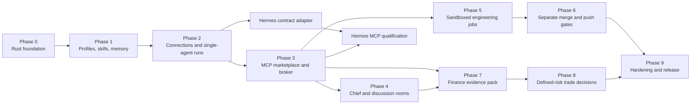

# AI Stock Forum — Agent Platform Delivery Phases

**Status:** Proposed version 1 roadmap incorporating approved decisions;
awaiting document review

**Updated:** 2026-08-29

**Canonical design:** [architecture.md](architecture.md)

This roadmap replaces the previous Python backend, React frontend, and
Hermes-first phase plans. Older plans are historical context only and must not
be executed without being rewritten against the current architecture.

**Repository warning:** the current README and older files under
`docs/superpowers/` still contain executable-looking legacy instructions. Until
Phase 0 adds superseded banners or moves them to history, do not use them as a
plan or source of truth.

## 1. How this roadmap is organized

Version 1 is a single Rust terminal application, so it is not divided into
separate frontend and backend projects. Instead, every phase is a **vertical
slice**: it adds the shell command, application behavior, policy checks,
persistence, adapter boundary, audit events, and tests needed for one usable
capability.

The internal boundaries still matter:

```text
terminal shell → application service → policy/domain logic → adapters/storage
```

The shell never owns business rules. This lets a future web or TUI frontend use
the same application service without rebuilding permissions, risk calculations,
or workflow transitions.

### Phase rules

Every phase must:

1. preserve all safety invariants in [architecture.md](architecture.md);
2. receive a new canonical, user-approved, test-driven implementation plan before
   code work starts; an obsolete plan may never be reused by path substitution;
3. divide large adapter, transport, host, or risk work into independently gated
   milestones inside that phase plan;
4. start each milestone with failing tests for the behavior being added;
5. work offline with fake providers, runtimes, MCPs, and synthetic finance data;
6. keep paid-provider/live-runtime tests out of the default suite, while still
   requiring release conformance for every advertised integration;
7. include migrations and recovery behavior for new durable state;
8. emit typed, redacted audit events for sensitive actions;
9. fail closed rather than silently use a more permissive path;
10. update user help and architecture notes when an interface changes; and
11. pass its exit gate before the next dependent phase begins.

No phase may introduce a VM, unrestricted coding mode, broker execution,
automatic merge/push, community MCP installation, or agent-controlled permission
change.

## 2. Dependency map



The Hermes contract adapter can start after Phase 2; its full tool qualification
also depends on Phase 3. Neither milestone may delay core work or force changes
that couple the platform to Hermes. Core version 1 does not block on an external
Hermes installation, but the product may advertise Hermes as `supported` only
after both qualification gates pass.

## 3. Cross-phase architecture decisions

These choices are already approved and should not be reopened inside an
implementation phase unless new evidence shows they are impossible:

- one Rust modular monolith and one interactive terminal executable;
- direct provider adapters as the primary inference path;
- Hermes behind an optional common runtime adapter;
- Chief of Staff as a policy-constrained coordinator, with the user above it;
- versioned agent profiles, skills, memory, policy, and approvals;
- user-approved internal MCP entries and lazy per-turn tool-schema loading;
- coordinator-mediated, bounded agent discussions;
- Codex CLI or Claude Code selected by the user for each engineering profile/job;
- strict built-in runtime sandbox plus an isolated Git worktree;
- hard refusal if the required sandbox is unavailable;
- no VM and no unrestricted or bypass mode;
- one exact approval for merge and a later, separate exact approval for push;
- deterministic finance validation and defined-risk recommendations only; and
- no broker order interface in version 1.

## Phase 0 — Rust foundation and interactive shell

### Objective

Create the smallest durable Rust application that can accept commands, persist
state, emit audit events, and recover cleanly after restart.

### User-visible result

The user can start one executable, see `forum>`, run `/help`, `/status`,
`/audit tail`, and `/quit`, and restart without losing the local installation
identity or event history.

### Scope

- Before code changes, update the README to point at these canonical documents
  and place a prominent `SUPERSEDED — DO NOT EXECUTE` banner on every legacy
  spec/plan, or move it under an explicit history directory while preserving Git
  history.
- Establish the Rust toolchain policy, formatting, linting, test, and build
  commands.
- Create module boundaries for shell, app, policy, persistence, audit, agents,
  rooms, adapters, jobs, and domain packs.
- Implement a line-oriented REPL with structured command parsing and clear error
  rendering.
- Add an application command bus so the shell cannot call storage or adapters
  directly.
- Define stable IDs, timestamps, object versions/digests, typed errors, and
  normalized event envelopes.
- Add SQLite migrations, transactions, owner-only local state permissions, and
  an append-only event repository.
- Add configuration discovery using platform-appropriate application directories;
  keep secrets out of configuration and SQLite.
- Add the initial deny-wins capability vocabulary and typed approval record
  skeleton, without sensitive approval actions yet.
- Add clean shutdown, interrupted-operation recovery hooks, fake clock/ID
  support, and deterministic test fixtures.
- Inventory old Python/web artifacts in the detailed Phase 0 plan. Remove or
  archive them only as an explicit reviewed change; do not touch unrelated user
  files merely because they are not part of the target architecture.

### Exit gate

- The README identifies the Rust terminal design as current, and no legacy
  document claims to be approved, canonical, or executable without a superseded
  warning.
- Fresh install, migration, restart, and corrupt/incompatible-database error
  paths are tested.
- Commands flow shell → application service → repository and generate typed
  events.
- Unknown commands and malformed input cannot panic the process.
- `cargo fmt`, strict linting, unit tests, and integration tests pass.
- No Python, Node, browser, provider credential, subscription, or network access
  is required to run the executable or default tests.

### Explicitly deferred

Agents, real providers, MCP, discussions, engineering processes, Git promotion,
and finance behavior.

## Phase 1 — Agent profiles, skills, and hybrid memory

### Objective

Let the user define the durable identity and context of an agent without calling
a real model.

### User-visible result

The user can create a Bull, Bear, Chief, or Engineering profile; give each a
personality and specialty; assign skills; edit private memory; inspect version
history; and activate a reviewed profile revision.

### Scope

- Implement immutable `AgentProfileVersion` records and current-version
  projections.
- Add `/agent create|list|show|edit|history` with guided editing, validation,
  field-level diffs, and activation confirmation.
- Support separate inference and optional engineering bindings as references;
  the actual adapters arrive later.
- Implement versioned declarative skill manifests, content, static resources,
  assignment, and compact relevance metadata.
- Ensure skills cannot declare or imply executable capabilities.
- Add `/skill add|list|show|assign|unassign` and plural list aliases.
- Implement agent-private KV memory, direct user edits, agent-originated memory
  proposals, and explicit proposal approval/rejection.
- Implement bounded episodic-summary records linked to source events, without
  automatically treating summaries as facts.
- Add scoped memory/skill retrieval budgets and pin exact versions for a future
  execution.
- Ensure profile duplication does not duplicate or expose secret values.

### Exit gate

- Editing always creates a new version; existing versions and pinned references
  remain immutable.
- Two profiles bound to the same placeholder runtime retain different
  personalities, skills, grants, and memory namespaces.
- An agent-authored memory change cannot become durable without user approval.
- A skill cannot add an MCP, provider, filesystem, network, or Git capability.
- Export/editor flows contain no secret fields and reject malformed revisions
  before activation.
- Migration, retrieval-budget, isolation, and approval tests pass.

### Explicitly deferred

Real model calls, Hermes, MCP connections, rooms, engineering children, and
finance-specific skills.

## Phase 2 — Connections, normalized inference, and single-agent runs

### Objective

Connect agent profiles to models without coupling orchestration to a vendor or
placing credentials in application data.

### User-visible result

The user can add/test a direct OpenAI, Anthropic, or xAI API connection, bind a
profile to a model, and have a private single-agent conversation. Plain text can
be routed to a minimally configured Chief profile.

### Scope

- Define the common provider/agent-runtime request, structured-output, tool-loop,
  usage, cancellation, and normalized-event contracts.
- Implement a deterministic fake provider for all default tests.
- Add `/connection add|list|test|remove` with connection type, safe account
  label, availability, and secret reference.
- Integrate the operating-system credential store for direct API keys. Never
  persist or display the raw key after entry.
- Represent runtime-managed login separately from direct API keys. Do not copy,
  export, or reinterpret subscription/session credentials.
- Add direct OpenAI, Anthropic, and xAI adapters behind the same contract.
- Add bounded retries, deadlines, cancellation, output-schema validation,
  redaction, usage reporting, and clear provider-unavailable states.
- Build prompt context from the pinned profile, personality, relevant skill
  versions, scoped memory, and application policy—not from the full database.
- Add a minimal Chief profile template. At this phase it can converse and route
  explicit shell commands but cannot yet open multi-agent rooms.
- Record normalized request/result metadata without leaking prompt credentials or
  authorization headers.

### Exit gate

- The same contract suite passes for fake, OpenAI, Anthropic, and xAI adapters.
- Default tests use fake transport and contain no network dependency.
- Opt-in live smoke tests work only for connections the user has configured and
  skip safely otherwise.
- Removing a connection makes dependent profiles unavailable without deleting
  their configuration or silently selecting another model.
- A runtime-managed login cannot be read back as an API key.
- Cancellation, timeout, malformed structured output, rate-limit, and redaction
  behavior is tested.

### Explicitly deferred

Multi-agent rooms, MCP use, engineering CLI launch, and automatic fallback from
one provider/runtime to another.

## Hermes compatibility track — optional adapter, never a foundation

### Timing and rule

Adapter/interface work starts after Phase 2 defines the common runtime contract.
Full tool/MCP qualification starts only after Phase 3. The track can otherwise
run alongside later phases. No core module may import Hermes-specific types.

### Scope

- Verify Hermes' current, supported non-interactive or service interface,
  authentication behavior, cancellation, structured output, and tool support.
- Map it into the normalized agent-runtime contract without terminal
  screen-scraping or parsing human-formatted UI text.
- Prove isolation of each platform profile's prompt, skills, native/runtime
  state, credentials, memory, tools, and MCP grants even when profiles share one
  Hermes installation.
- Pass only the MCP capability metadata and transient tool configuration selected
  by the platform broker; never expose the entire internal marketplace.
- Treat ChatGPT or other subscription login as runtime-managed authentication.
  Do not extract credentials or pretend it is a direct provider API key.
- Report installation/login/contract incompatibility as `Unavailable`; never
  weaken policy or silently switch the agent to another runtime.

### Qualification gate

- Two profiles using Hermes can return different role-bound outputs without
  sharing runtime state, credentials, private memory, tools, or permissions.
- Structured execution correlation, cancellation, timeouts, token/tool
  accounting when available, and broker enforcement of every lazy MCP request
  pass the runtime contract tests.
- A Hermes failure does not affect direct-provider agents or room persistence.

Hermes is a version 1 compatibility target, but it is not a dependency for core
development. A release may label Hermes `supported` only after this gate passes;
otherwise it must be labeled experimental or unavailable rather than simulated.

## Phase 3 — Internal MCP marketplace and lazy tool broker

### Objective

Let agents select relevant tools from a reviewed internal catalog without
loading every server or schema into context.

### User-visible result

The user can review an MCP entry, approve it into the internal marketplace,
grant it to selected agents, see why an agent requested it, and inspect its
short-lived activation and results in the audit trail.

### Scope

- Define versioned MCP entry manifests with source, digest, transport,
  executable/endpoint, capability tags, effect/risk class, secret references,
  and review metadata.
- Add `/marketplace list|show|approve|revoke` and
  `/mcp grant|revoke|status`.
- Implement separate concurrent records: `EntryVersion` approval/revocation,
  `Grant(profile, entry_digest)` activation/revocation, and
  `ActivationLease(grant, operation)` selection/activation/release.
- Show each agent only a compact index of its granted entries.
- Implement the staged lazy handshake: compact entry index, structured entry
  request, broker-side discovery, bounded tool summaries, tool selection, then a
  later model turn containing only the exact selected schemas.
- Recheck grant, policy, relevance, and lease state before discovery and again
  before invocation.
- Implement local-process and supported remote transports behind a broker-owned
  lifecycle.
- Launch local MCP executables without a shell and apply a minimal environment
  plus manifest-declared filesystem/network limits in a broker-managed host
  sandbox. Refuse activation when those limits cannot be enforced.
- Add startup/connect/call/idle timeouts, cancellation, response-size limits,
  redaction, health state, version/digest checks, and lease cleanup.
- Revalidate canonical manifests and all local launch artifacts at every
  activation. Pin remote canonical origin/server identity and discovered schema
  digest; treat any mismatch as a new unapproved entry version.
- Treat all tool descriptions/results as untrusted evidence and isolate them from
  policy/system instructions.
- Support explicit read/write effect metadata. Read-only is the initial allowed
  policy. Any future external-write invocation must use a separately defined
  typed capability and exact approval; it may not inherit read permission.
- Enforce read-only effects independently with read-only credentials and mounts
  plus mutation-denying network mediation where needed. Treat effect metadata as
  untrusted and refuse activation when mutation cannot be prevented.
- Include a synthetic read-only fixture MCP for offline tests.

### Exit gate

- Catalog approval does not grant an agent access, and a grant does not start a
  server or load a schema.
- An agent can select only from its granted subset; denied/revoked requests fail
  before process/network activity.
- Only selected schemas appear in recorded prompt-context manifests.
- Multiple profiles and turns can hold independent concurrent grants/leases;
  entry or grant revocation terminates exactly the matching leases and every new
  selection revalidates instead of reusing a released lease.
- Replacing a local executable/manifest or changing a remote identity/schema
  invalidates activation and cannot inherit the old entry's grants.
- Server crashes, hangs, oversized output, schema drift, malicious instructions,
  revocation, and expired leases fail safely and are audited.
- A local fixture cannot read undeclared paths, use undeclared network routes, or
  escape through symlinks; absence of the required host sandbox fails closed.
- No raw MCP secret reaches an agent prompt or general log.
- The fixture MCP proves lifecycle cleanup after success, failure, and cancel.

### Explicitly deferred

Community discovery, automatic installation, unpinned updates, and general
write-capable MCP actions.

## Phase 4 — Chief of Staff and bounded discussion rooms

### Objective

Create the provider-neutral multi-agent forum and preserve disagreement rather
than forcing consensus.

### User-visible result

The user asks the Chief a question, reviews or edits a proposed roster and room
budget, watches named agents produce independent views and bounded rebuttals,
and receives a synthesis with evidence, uncertainty, and dissent.

### Scope

- Add `/room new|list|show|send|stop` and plain-text routing to the active room.
- Implement the room state machine: proposed, gathering, independent, challenge,
  rebuttal, synthesis, validating, completed/partial/failed/cancelled.
- Pin agent, skill, policy, memory-snapshot, model, and MCP-entry versions at room
  start.
- Let the Chief propose objective, roster, evidence needs, allowed capability
  categories, round count, time, token, and cost budgets from existing grants.
- Keep first-pass responses sealed until all agents respond or the round deadline
  closes, reducing anchoring between Bull/Bear or other roles.
- Route typed claims, evidence references, confidence, questions, concessions,
  and rebuttals through the coordinator.
- Allow agents to request relevant granted MCPs through the Phase 3 broker.
- Add a synthesizer contract that returns recommendation, neutral/no action,
  split decision, or insufficient evidence and preserves material dissent.
- Allow the user to interrupt, add context, stop the room, or ask a follow-up.
- Persist enough state to resume or terminate deterministically after restart.

### Exit gate

- A Bull and Bear can use the same provider/runtime while retaining separate
  pinned profiles and sealed first passes.
- No unrestricted agent-to-agent channel exists outside coordinator events.
- Turn/time/token/cost limits always terminate with a labeled partial result.
- The Chief cannot add ungranted agents/MCPs, change a profile/runtime, approve a
  memory mutation, or override a denial.
- Synthesis fixtures prove that dissent and unavailable evidence are not erased.
- Cancellation and crash recovery leave an inspectable audit trail.

### Explicitly deferred

Finance recommendations, unlimited debates, majority voting as an authority
mechanism, and remote/background rooms.

## Phase 5 — Strictly sandboxed engineering jobs

### Objective

Let a user-designated Engineering Agent make repository changes through Codex
CLI or Claude Code while containing effects to a dedicated worktree.

### User-visible result

The user selects a repository, base ref, task, agent, runtime, and limits; starts
a job; watches normalized progress; cancels if needed; and reviews the preserved
worktree, independently derived diff, checks, platform-created checkpoint, and
failures. The Chief may prepare the same bounded job proposal, but only the user
can accept and start it. This phase cannot merge or push.

### Scope

- Add `/job start|list|show|cancel|diff` and guided job specification.
- Let the Chief create a policy-bounded job proposal using only already allowed
  repositories, agents, runtimes, MCP grants, and limits. Starting it requires
  explicit user acceptance; an edit creates a new proposal digest.
- Implement repository/base-ref validation and a dedicated job branch/worktree
  manager. Treat worktrees as change isolation, not security.
- Implement `StructuredProcessRunner` using explicit executable/argument arrays,
  stdin, cwd, minimal environment, limits, cancellation, and process-tree cleanup.
- Add fake-runtime contract tests before live adapters.
- Implement Codex CLI and Claude Code adapters using their supported structured
  non-interactive output, with current flags verified against official docs.
- Bind a default engineering runtime to a profile and allow an explicit per-job
  user override. Never let the agent/runtime choose a different runtime.
- Require each adapter to produce a machine-checkable sandbox capability report
  for the exact host/runtime/adapter versions; verify it with negative
  conformance tests rather than trusting a flag name.
- Pin the canonical identity, digest/signature, and effective configuration of
  the runtime binary, adapter build, and OS sandbox backend; any change disables
  that tuple until it is requalified.
- Before every launch, compare a fresh capability attestation with the job's
  required policy and refuse the job if any capability is absent or changed.
- Limit writes to the worktree and narrowly required temporary paths; restrict
  command network access; expose only transient, granted MCP routes.
- Remove Git credentials, signing keys, unrelated API keys, and broad environment
  values from the child. Runtime-managed login remains owned by that runtime.
- Forbid unrestricted, danger, bypass, unsandboxed retry, or fallback modes.
- Hide the actual shared Git metadata from the coding child. Give it a
  broker-generated sanitized read-only Git view for status/diff that omits
  remotes, credentials, hooks, signing, and unrelated worktree metadata. It may
  edit worktree files but may not commit or update any ref.
- After the child exits, the trusted job service independently derives the diff,
  launches approved checks in a fresh verifier sandbox with no ref writes,
  credentials, or general network, and never executes repository code in the
  core process.
- Create a typed checkpoint on the dedicated branch with controlled Git plumbing
  that constructs the tree from reviewed bytes and disables hooks, filters,
  signing, credential helpers, and user/repository configuration side effects.
- Normalize process, command, file, MCP, usage, result, timeout, cancellation, and
  failure events as untrusted telemetry; never accept their claims as proof of a
  diff, object ID, check, or permission.
- Establish owner-death or guardian-process containment before launch. On
  restart, reconcile/terminate recorded survivors, mark interrupted, and
  preserve the worktree before accepting new jobs.

### Exit gate

- If required sandbox enforcement is absent or misconfigured, no coding child is
  launched.
- Negative conformance tests for every advertised `(host, runtime version,
  adapter version)` prove the child cannot read or write unauthorized home,
  credential, configuration, Git-metadata, or repository paths; escape through
  symlinks/hardlinks; access blocked network routes; inherit unrelated secrets;
  leave surviving descendants; update refs; merge; or push.
- Arguments containing spaces, quotes, or shell metacharacters cannot become
  shell execution because the runner never builds a shell string.
- Timeout, cancel, runtime crash, application crash/restart, and output overflow
  preserve a coherent job state and inspectable worktree.
- Fake runtime tests pass offline. A Codex or Claude host/runtime pairing is not
  advertised until its full sandbox conformance suite passes with that installed
  and signed-in runtime.
- A Chief proposal cannot start itself, broaden its scope after acceptance, or
  bypass the same sandbox/worktree gates as a user-authored job.
- No VM and no unrestricted mode exists in configuration or code.

### Explicitly deferred

Merge, push, deployment, arbitrary host directories, dirty-working-tree import,
and remote workers.

## Phase 6 — Review, exact merge approval, and separate push approval

### Objective

Promote a reviewed engineering result without turning one approval into broad
Git authority.

### User-visible result

The user reviews a frozen source checkpoint, checks, and prebuilt merge candidate;
approves an exact conditional local ref update; then sees that exact merged
commit. Only afterward may the user separately approve an exact
fast-forward-only push to a named remote and ref using an exact
expected-old-object lease.

### Scope

- Add review summaries with repository identity, source checkpoint, expected
  target ref/object ID, diff digest, checks digest, unresolved warnings, and
  policy version.
- Build the candidate in a controlled promotion worktree with hooks, signing,
  user Git configuration, and credential helpers disabled. Stop on conflicts;
  otherwise compute the candidate tree and commit without updating the target
  ref.
- Add typed `git.merge` approval creation, display, accept, reject, expiry, and
  one-shot atomic claim. Its digest includes source object ID, target ref and
  expected object ID, merge strategy/options, controlled Git configuration,
  checks digest, abort-on-conflict rule, candidate tree/commit, and policy.
- Revalidate every pinned input immediately before conditionally updating the
  target ref to the exact candidate. Reconcile an interrupted update
  idempotently on restart.
- Stop on conflicts. Conflict resolution becomes a new reviewed job/result, not
  an implicit expansion of the old approval.
- Create a different typed `git.push` proposal containing repository identity,
  exact merged object ID, canonical remote URL/identity, destination ref,
  expected remote object ID, and fast-forward-only exact-lease single-ref mode.
- Require a fresh, separate one-shot atomic claim and revalidation immediately
  before push.
- Use an atomic expected-old-object compare-and-swap and independently prove the
  new commit descends from the approved expected object. Distinguish this narrow
  enforcement lease from prohibited broad or non-fast-forward force.
- Deny broad leases, changed expected objects, non-fast-forward/force pushes, ref
  deletion, tag mutation, multiple-ref pushes, deployment, and approval reuse in
  version 1.
- Audit proposal, approval/rejection, preflight, local result, remote result, and
  any invalidation without recording credentials.

### Exit gate

- Merge approval cannot trigger, imply, queue, or pre-authorize a push.
- Changing source/target object, target ref, diff, checks, merge
  strategy/options, controlled Git configuration, candidate tree/commit, policy,
  canonical remote identity, expected remote object, or push destination
  invalidates the applicable approval.
- The promoted target tree equals the user-reviewed candidate tree exactly;
  hooks, signing, and user configuration cannot change it.
- Push is impossible before a successful approved local merge in this workflow.
- A remote race or expected-object mismatch fails without updating the remote,
  even if the changed remote would still accept an ordinary fast-forward push.
- Conflict, non-fast-forward remote state, expired approval, failed checks,
  missing audit persistence, and interrupted operation stop safely.
- Integration tests use temporary repositories and a local bare remote; no real
  remote or credential is needed.
- The user's existing checkout and uncommitted files remain untouched.

### Explicitly deferred

Force push, automatic pull/rebase, branch deletion, tags, PR creation,
deployment, release, and any combined “merge and push” command.

## Phase 7 — Finance evidence and GEX domain pack

### Objective

Add finance as the first compile-time domain pack while keeping evidence
collection separate from model judgment.

### User-visible result

The user opens a finance room for a stock and swing horizon, sees a timestamped
evidence report—including read-only GEX when granted—and sees what is stale,
missing, conflicting, or unavailable before any trade conclusion.

### Scope

- Define the domain-pack interface for room templates, evidence schemas,
  specialist roles, structured outputs, deterministic validators, and rendering.
- Add the finance pack without adding finance rules to generic room modules.
- Define immutable evidence envelopes with symbol, as-of time, source IDs,
  retrieval time, content digest, freshness, conflicts, and missing fields.
- Add adapters or approved read-only MCP pathways for market data, option chains,
  news/filing references, and user/account capacity evidence. The envelope also
  records the user's explicit current risk budget or its absence.
- Add a pinned read-only GEX marketplace entry/projection and let only granted
  agents select it lazily through the MCP broker.
- Validate symbol, timestamps, chain structure, contract multiplier, quote
  consistency, and configured freshness windows before evidence reaches agents.
- Give all independent agents the same core envelope and role-specific
  projections that retain source references.
- Provide fixed finance specialties such as Bull, Bear, technical/GEX,
  fundamental/catalyst, options structure, and risk/liquidity; user profiles may
  bind these roles to any compatible provider/runtime.
- Record missing sources explicitly and prevent models from filling them with
  uncited guesses.
- Use synthetic data fixtures and deterministic clocks in default tests.

### Exit gate

- Repeating a run against the same synthetic envelope produces the same IDs,
  freshness decisions, and role projections.
- GEX is not connected and its schemas are not loaded for agents that do not
  select it or lack a grant.
- Stale, contradictory, malformed, partial, timed-out, and malicious-source data
  is labeled and cannot masquerade as verified evidence.
- Every displayed finance claim can reference an envelope source ID or is clearly
  labeled as analysis/opinion.
- Finance modules can be disabled without breaking generic agent rooms.

### Explicitly deferred

Trade eligibility, payoff/risk calculations, plan approval, real-time streaming,
and broker writes.

## Phase 8 — Deterministic defined-risk recommendations

### Objective

Turn finance discussion into a specific, mechanically validated swing-trade plan
or an evidence-backed reason not to trade.

### User-visible result

The forum returns an exact cash-funded stock or supported defined-risk option
plan, `NoTrade`, `SplitDecision`, or `InsufficientEvidence`. It shows Bull/Bear
evidence, dissent, maximum loss, exits, invalidation, and failed gates. The user
may approve the exact recommendation for planning, but the platform cannot send
an order.

### Scope

- Define typed stock and option legs, quotes, fees, quantities, expirations,
  settlement/style, multipliers, assignment/exercise assumptions, rounding,
  risk budgets, capacity snapshots, and plan versions.
- Implement deterministic payoff and maximum-loss calculations in Rust.
- Support cash-funded long stock only; reject short stock.
- Close the version 1 option enum to `LongCall`, `LongPut`,
  `BullCallDebitSpread`, `BearPutDebitSpread`, `BullPutCreditSpread`,
  `BearCallCreditSpread`, `LongCallButterfly`, `LongPutButterfly`, and
  `IronCondor`.
- Require one underlying, one expiration, supported unadjusted
  style/settlement, an explicit multiplier, integer quantities, and each enum's
  exact leg ratio. Reject every structure outside that closed contract.
- Reject uncovered shorts, unbounded ratio exposure, cross-expiry interactions,
  stale/illiquid inputs, incomplete legs, unsupported assignment/exercise or
  settlement states, or any position whose worst case cannot be proven.
- Implement deterministic freshness, liquidity, concentration, cash funding,
  account-capacity, risk-budget, maximum-loss, fees, and rounding gates. An
  absent current user budget or capacity snapshot prevents eligibility and
  cannot be filled by a model default.
- Require agents to propose structured candidates; never parse trade authority
  from prose.
- Run deterministic validation after synthesis and preserve all failures.
- Render exact entry limit, debit/credit, legs/shares, maximum loss, risk percent,
  pinned budget/capacity snapshot, profit/exit plan, time stop, thesis
  invalidation, evidence snapshot, and engine/policy versions.
- Require concrete evidence and failed gates for `NoTrade`; preserve unresolved
  disagreement for `SplitDecision` and missing facts for
  `InsufficientEvidence`.
- Add immutable finance-plan digests and exact recommendation approval with
  automatic invalidation on any material change.
- Keep approval as a local planning/audit record. Do not define a broker-write
  port, order object adapter, or execution command.

### Exit gate

- Property tests and exhaustive boundary fixtures verify payoff and maximum-loss
  behavior, fees, rounding, assignment/exercise, capacity, and every exact ratio
  for the closed structure enum; all other or uncapped cases are rejected.
- Independent reference calculations match the engine for synthetic fixtures.
- Changing any leg, quantity, quote, expiration, risk budget/capacity snapshot,
  evidence snapshot, engine version, or policy version invalidates approval.
- Agents, skills, Chief, and MCP output cannot override a failed deterministic
  gate.
- An unavailable GEX source can be represented without inventing data; policy
  determines whether the result is `NoTrade` or `InsufficientEvidence`.
- End-to-end synthetic sessions cover eligible stock, defined-risk multi-leg,
  no-trade, split, missing evidence, and expired-plan scenarios.
- Repository search and capability tests confirm no broker execution path exists.

### Explicitly deferred

Unsupported multi-expiration structures, naked options, margin-dependent
unbounded positions, live orders, paper orders, auto-refresh/reapproval, and
portfolio automation.

## Phase 9 — Security hardening, recovery, and version 1 release

### Objective

Prove the whole system behaves coherently under failure and package it for safe
local use.

### User-visible result

The user can install the terminal application, complete guided setup, configure
agents/connections/MCPs, run general and finance rooms, run contained engineering
jobs, recover interrupted work, inspect/export an audit trail, and deliberately
approve merge, push, memory, and finance-plan actions.

### Scope

- Perform end-to-end threat-model review for prompt injection, MCP compromise,
  credential leakage, sandbox escape attempts, approval confusion, and corrupted
  persistence.
- Add resource quotas, log rotation/retention controls, redacted audit export,
  backup/restore guidance, health diagnostics, and migration recovery tooling.
- Fuzz command parsing, normalized provider/runtime events, MCP manifests/results,
  finance inputs, and persisted event decoding.
- Add crash tests across every durable workflow state and confirm idempotent
  restart behavior.
- Verify owner-only file permissions and secret redaction across logs, errors,
  exports, child environments, and support bundles.
- Re-run sandbox negative conformance for every advertised
  `(host, runtime version, adapter version)` tuple; disable any tuple that no
  longer proves all required capabilities.
- Run negative Git tests for protected refs, changing remotes, non-fast-forward
  state, force attempts, stale approvals, and dirty user checkouts.
- Add installation/setup/status documentation, command reference, sample safe
  profiles, synthetic finance demo, and troubleshooting guidance.
- Provide clear adapter capability/availability reporting. Hermes is labeled
  supported only if its separate qualification gate passed.
- Produce a reproducible release build and software-bill-of-materials/dependency
  audit appropriate for a local security-sensitive tool.

### Exit gate

- All unit, property, contract, integration, recovery, security-negative, and
  synthetic end-to-end suites pass from a clean checkout.
- The default suite remains offline and secret-free.
- Every advertised host/runtime/adapter tuple proves strict sandbox behavior,
  unauthorized-read/write denial, worktree containment, process cleanup,
  cancellation, and no-unrestricted fallback.
- Merge and push remain distinct exact approvals in UI, policy, persistence,
  tests, and audit events.
- A fresh user can follow the docs without relying on the obsolete web/Python
  plans.
- Known limitations are documented; unsupported adapters/features show
  unavailable rather than silently falling back.

## 4. Version 1 definition of done

Version 1 is complete only when all applicable phase gates pass and the user can:

- create and version agents with fixed specialties, personality, skills, memory,
  model/runtime bindings, and MCP grants;
- use direct OpenAI, Anthropic, and xAI connections without storing raw keys in
  application data;
- use Hermes only through the common adapter when its qualification gate passes;
- ask the Chief to coordinate bounded rooms while retaining user control;
- let agents lazily select only granted entries from an approved internal MCP
  marketplace;
- receive a transparent synthesis that may recommend, remain neutral, split, or
  report insufficient evidence;
- launch Codex CLI or Claude Code only with the user-selected runtime, strict
  built-in sandbox, isolated worktree, and no unrestricted fallback;
- review engineering results and give separate exact approvals for merge and
  push;
- obtain an evidence-backed, deterministic, defined-risk swing-trade plan or
  concrete reason not to trade; and
- inspect an audit trail and recover interrupted rooms/jobs without any broker
  execution capability.

## 5. Deferred roadmap

After version 1, separate design reviews may consider:

- Herdr or another general-purpose external terminal supervisor; the narrow
  fail-closed per-job guardian in Phase 5 remains required version 1 machinery;
- web, full-screen TUI, or mobile clients;
- remote workers, VMs, and multi-user/cloud operation;
- community MCP distribution and executable plugin packages;
- write-capable MCP workflows with domain-specific approval policies;
- additional compile-time domain packs;
- more option structures after deterministic risk-model support;
- broker read enhancements; and
- broker execution only as a new high-risk product boundary, never as an
  accidental extension of recommendation approval.

Unrestricted coding mode, automatic runtime switching, and combined automatic
merge/push are not planned defaults.

## 6. Immediate next step

After the user reviews these two canonical documents, write a detailed,
test-driven implementation plan for **Phase 0 only**. That plan must begin with
README/legacy-document cleanup, inventory the current repository, identify
exactly which legacy tracked files are replaced or retained, preserve unrelated
user work, and define review checkpoints before any code rewrite begins. Every
later phase receives its own newly approved plan when it becomes current.
